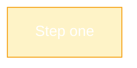
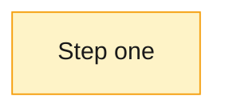
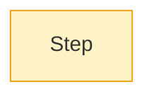
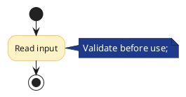

# Color Contrast Practices

## Practice

A diagram is useless if its labels cannot be read. The single most common
readability failure in auto-generated and hand-authored diagrams is **light
text on a pastel or light fill** — white or near-white text placed on a pale
yellow, pale blue, pale green, or pale pink background. The contrast ratio
collapses below WCAG AA (4.5:1) and the text disappears into the background,
especially on dim screens, in printed output, and for low-vision readers.

This is an **accessibility** practice, not an aesthetics preference. It applies
to every diagram tool in this bundle.

### 1. Never host light text on a pastel or light fill

This is the hard rule. A pastel fill (`#fef3c7`, `#dbeafe`, `#e6f4ea`,
`#fce7f3`, etc.) is a **light** background. Light text (white `#ffffff`,
`#f8fafc`, light gray) on a light background fails contrast.





**Rule**: If the fill is pastel or light, the text **must** be dark
(`#1a1a1a`, `#0f172a`, `#111827`, near-black). No exceptions for body labels.

### 2. Pair fills and text by luminance, not by hue

The safe pairings are exactly two:

| Fill luminance | Text color | Example fill | Example text | Typical contrast |
|----------------|------------|--------------|--------------|------------------|
| Light / pastel | Dark | `#fef3c7`, `#dbeafe`, `#e6f4ea` | `#1a1a1a`, `#0f172a` | 10:1+ |
| Dark / saturated | Light | `#1e3a8a`, `#064e3b`, `#7c2d12` | `#ffffff`, `#f8fafc` | 8:1+ |

Anything in between (mid-tone fills with mid-tone text) is fragile and should
be avoided unless you have measured the contrast ratio.

### 3. Target WCAG AA 4.5:1 for normal text, 3:1 for large text

WCAG AA (the same threshold used for web accessibility) is the readability
floor for diagram labels:

- **Normal-size labels** (the default in Mermaid, PlantUML, Excalidraw):
  **4.5:1** minimum contrast between text and fill.
- **Large labels** (≥18pt or ≥14pt bold, rare in diagrams): **3:1** minimum.
- **Borders and strokes** against the surrounding background: **3:1** minimum.

When in doubt, measure. Browser devtools contrast checkers, the
[WebAIM Contrast Checker](https://webaim.org/resources/contrastchecker/), or
`wcag-contrast` npm package all compute the ratio from two hex colors.

### 4. Mermaid: set `color` explicitly in `classDef` and `style`

Mermaid inherits a default text color from the renderer theme. When you set a
custom `fill`, the inherited text color may no longer have sufficient contrast
against it. **Always set `color` alongside `fill`** in the same directive:

```mermaid
flowchart TD
    S["Start"]:::start
    D["Decision"]:::decision
    E["End"]:::end
    S --> D --> E

    %% ✅ Light fill + dark text
    classDef start fill:#dbeafe,stroke:#1e40af,color:#0f172a
    %% ✅ Dark fill + light text
    classDef decision fill:#1e3a8a,stroke:#1e3a8a,color:#ffffff
    %% ✅ Light fill + dark text
    classDef end fill:#e6f4ea,stroke:#137333,color:#0f172a
```



The same rule applies to per-node `style` directives:
`style NODE fill:#...,color:#...` — set both, not just `fill`.

### 5. PlantUML: set `FontColor` alongside `BackgroundColor` in `skinparam`

PlantUML's `skinparam` lets you theme by element type. The same pairing rule
applies — set `FontColor` whenever you set a custom `BackgroundColor`:



Per-element color overrides in PlantUML (`|#fef3c7|text|`) inherit the default
font color — verify it contrasts with the override, or set the font color
explicitly.

### 6. Excalidraw: set text color per element, do not rely on canvas default

Excalidraw stores `strokeColor` (text and border) and `backgroundColor` per
element in the JSON. When you change an element's background color, the text
color does not change automatically. Set both:

```json
{
  "type": "rectangle",
  "backgroundColor": "#fef3c7",
  "strokeColor": "#1a1a1a"
}
```

For text elements placed inside a filled rectangle, the text element's
`strokeColor` is the text color — set it dark when the rectangle behind it is
light.

### 7. Test in grayscale and in print

Two cheap checks catch contrast failures before they ship:

- **Grayscale preview**: desaturate the rendered diagram (macOS Preview
  `Adjust Color` → saturation 0, or `pngquant --quality 1` on a screenshot).
  If labels vanish, the fill/text luminance difference is too small.
- **Print preview**: many pastel fills render as near-white on black-and-white
  printers. If the diagram must survive print, prefer dark fills with light
  text, or add a dark border thick enough to outline the node even when the
  fill drops out.

## Why

A diagram that cannot be read is worse than no diagram — it looks authoritative
but communicates nothing. Light-on-pastel is the most common failure because
the colors look "soft and friendly" on a calibrated screen in a bright room,
then become illegible on a dim laptop, a projector washed out by room light, a
printed page, or a screenshot embedded in a dark-mode document.

This practice was motivated by a real failure: a set of ELI5 Mermaid diagrams
used pastel fills (`#fef3c7`, `#dbeafe`, `#fce7f3`) with white text, producing
contrast ratios around 1.2:1–1.4:1 — well below the 3:1 large-text floor and
far below the 4.5:1 normal-text floor. The labels were unreadable on first
render. The fix is not "pick prettier pastels"; the fix is "dark text on light
fills, light text on dark fills, always."

WCAG AA is the right threshold because it is the same one the documentation's
readers encounter everywhere else (web, PDF, app UI). Diagrams that meet it
read consistently across screen brightness, print, and accessibility tools.

## When this practice applies

- Any diagram with a custom fill color on a node, box, or label background —
  Mermaid (`classDef`, `style`), PlantUML (`skinparam`, per-element color),
  Excalidraw (element `backgroundColor`).
- Diagrams embedded in documentation read on multiple screens, in print, or in
  dark-mode viewers.
- Diagrams that may be screenshot-captured into slides, chat messages, or
  issues where the viewer cannot adjust the source colors.

## When this practice does NOT apply

- **Diagrams with no fill colors** (outline-only nodes, default theme) — the
  renderer's default text/fill pairing is already contrast-safe.
- **Pure black-on-white or white-on-black diagrams** — contrast is maximal by
  definition.
- **Decorative color accents that carry no text** (a colored border, a colored
  connector line) — only text-on-fill contrast is in scope here; the 3:1
  non-text contrast rule is a separate concern.

## See Also

- [Mermaid Practices](mermaidjs.md) — `classDef`/`style` syntax that the
  Mermaid guidance here builds on.
- [PlantUML Practices](plantuml.md) — `skinparam` theming that the PlantUML
  guidance here builds on.
- [Excalidraw Practices](excalidraw.md) — per-element color storage that the
  Excalidraw guidance here builds on.
- [Diagram Tool Selection](diagram-tool-selection.md) — choosing the tool
  before applying color conventions.

## Sources

- WCAG 2.1 Success Criterion 1.4.3 (Contrast Minimum) —
  [WebAIM Contrast Checker](https://webaim.org/resources/contrastchecker/),
  [W3C WCAG 2.1](https://www.w3.org/TR/WCAG21/#contrast-minimum).
- Real failure: ELI5 Git Merge Mermaid diagrams (conversation
  "ELI5 Git Merge Error with Mermaid Diagrams") — pastel fills with white text
  produced ~1.3:1 contrast and unreadable labels.
