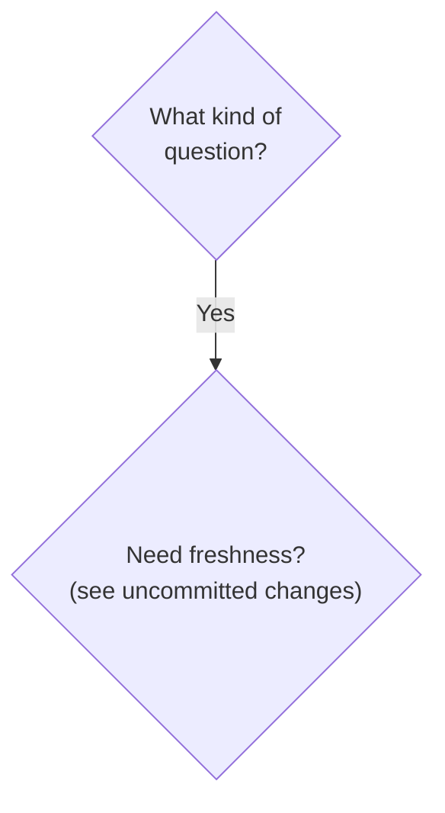
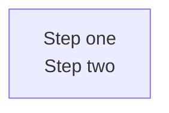
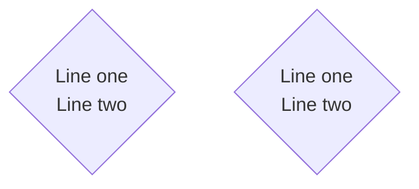
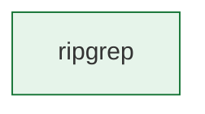

# Mermaid Practices

## Practice

Mermaid renders inline in GitHub, Obsidian, and VS Code — but markdown
pre-processors can strip HTML tags (`<br/>`) from inside mermaid code blocks
before Mermaid sees them. Follow these conventions to keep diagrams rendering
across all environments.

### 1. Quote every decision node label with special characters

**Decision nodes** (`{...}`) with `<br/>`, `(`, `)`, `<`, `>`, or `&` must be
wrapped in double quotes. Without quotes, the markdown pre-processor strips
`<br/>` to a literal newline, and the next line's `(` is parsed as a
parenthesis-start token — producing a parse error.



```mermaid
%% ❌ Wrong — unquoted, <br/> stripped to newline, parse error on (
flowchart TD
    Q1{What kind of<br/>question?}
    Q1 -->|Yes| A3_FRESH{Need freshness?<br/>(see uncommitted changes)}
```

**Rule**: If a decision node label contains anything other than alphanumerics,
spaces, and basic punctuation (`?`, `!`, `.`, `,`, `-`), wrap it in double
quotes: `{"..."}`.

### 2. Rectangle nodes with `<br/>` are already safe if quoted

Rectangle nodes `["..."]` are already quoted by convention, so `<br/>` inside
them is preserved:



### 3. Use `<br/>` (not `\n`) for line breaks inside quoted labels

Mermaid interprets `<br/>` as a line break inside quoted strings. The `\n`
escape is not reliably supported across renderers and may render as literal
text.



### 4. Style directives reference node IDs, not labels

Style directives (`style NODE fill:#...`) reference the node ID, not the label
text. Keep node IDs alphanumeric:



### 5. Keep diagrams under ~50 nodes for render performance

Mermaid diagrams with 50+ nodes render slowly in some environments (Obsidian,
GitHub on mobile). Split large decision trees into sub-diagrams linked by
markdown anchors, or use a separate "full decision tree" page.

## Why

ADR-20260520001 v3.0.0 had two Mermaid flowcharts that broke with parse errors
like:

```
Parse error on line 61:
...Need freshness?
(see uncommitted cha
-----------------------^
Expecting 'SQE', 'DOUBLECIRCLEEND', 'PE', '-)', ... got 'PS'
```

Root cause: unquoted decision node labels `{Need freshness?<br/>(see uncommitted changes)}`.
The markdown pre-processor stripped `<br/>` to a literal newline, and the `(` on
the next line was parsed as a parenthesis-start token. Quoting the labels
(`{"Need freshness?<br/>(see uncommitted changes)"}`) preserves `<br/>` as text
that Mermaid interprets as a line break.

This is a **root-cause fix**, not a workaround: the convention "quote any label
with special characters" is the documented Mermaid best practice and works
across all renderers.

## When this practice applies

- Authoring Mermaid diagrams in markdown documentation (ADRs, READMEs, design
  docs).
- Diagrams that will be rendered in multiple environments (GitHub, Obsidian,
  VS Code, static site generators).
- Any Mermaid diagram using decision nodes (`{...}`) with multi-line labels or
  parenthetical clarifications.

## When this practice does NOT apply

- **PlantUML diagrams** — different syntax, see [PlantUML Practices](plantuml.md).
- **Excalidraw diagrams** — GUI editor, no text syntax, see
  [Excalidraw Practices](excalidraw.md).
- **Mermaid diagrams with only simple single-line alphanumeric labels** —
  quoting is optional but harmless.

## See Also

- [Diagram Tool Selection](diagram-tool-selection.md) — when to pick Mermaid
  over PlantUML or Excalidraw.
- [PlantUML Practices](plantuml.md) — the text-based UML alternative.
- [software-architecture-essentials](https://github.com/levonk/skills-releases/blob/main/knowledge/software-architecture-essentials/overview.md) —
  ADRs that embed decision trees rely on these Mermaid conventions.

## Sources

- ADR-20260520001 v3.0.0 — `ADR-20260520001 v3.0.0 (job-aide internal-docs)`
  (two Mermaid flowcharts fixed by quoting decision node labels with `<br/>`
  and `(`).
- Mermaid official docs — [Flowchart syntax](https://mermaid.js.org/syntax/flowchart.html)
  (quoted node labels, `<br/>` line breaks).
