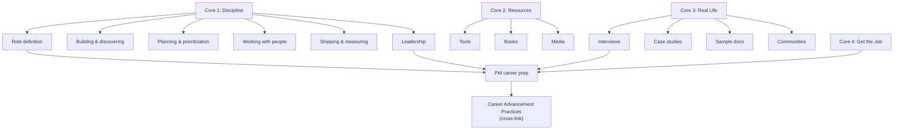

---
description: STE100-inspired Simplified Technical English guidelines for technical prose output — active voice, short sentences, one-word-one-meaning, imperative for instructions
---

### Simplified Technical English (STE100-Inspired)

This artifact produces technical English (instructions, procedures, descriptions,
reference documentation). Apply these STE100-inspired guidelines to all technical
prose output so the result is unambiguous, translatable, and easy to read for
non-native speakers and for AI agents that must execute the steps precisely.

These are **STE-inspired guidelines**, not the full ASD-STE100 vocabulary
restriction. Domain terms (Dockerfile, pnpm, devbox, Nx, etc.) are permitted
when they are the correct technical term — STE100's 1000-word approved
vocabulary is too narrow for this domain. The goal is the *clarity discipline*
of STE100, not its word list.

For the full writing rules, before/after examples, and the approved-words
reference, see the
[Simplified Technical English](https://github.com/levonk/skills-releases/blob/main/knowledge/simplified-technical-english/simplified-technical-english.md)
and
[Detailed Guide](https://github.com/levonk/skills-releases/blob/main/knowledge/simplified-technical-english/detailed-guide.md)
concept pages in the `simplified-technical-english` knowledge bundle. The
bundle is the canonical, publicly-reachable home for these guidelines; this
include is the build-time gist that gets inlined into skills and other
bundles.

#### Core Principles

1. **One word, one meaning.** Pick one term for each concept and use it
   everywhere. Do not alternate between "image" and "container image" and
   "docker image" for the same thing. Pick one, define it once, reuse it.

2. **Short sentences.** Keep procedural sentences under 20 words. Keep
   descriptive sentences under 25 words. Split long sentences into two.

3. **Active voice.** Write "The build copies the file" not "The file is copied
   by the build." The actor does the action. Passive voice hides who does what
   and is the single largest source of ambiguity in technical prose.

4. **Imperative mood for instructions.** Write "Run the tests" not "You should
   run the tests" or "The tests should be run." Instructions tell the reader
   (or agent) what to do, directly.

5. **One topic per sentence.** One idea per sentence. Do not chain unrelated
   clauses with "and" or "while." If a sentence has two ideas, split it.

6. **Consistent verb forms.** Use the same verb for the same action across the
   document. If you "run" a script in section 1, do not "execute" it in
   section 2. Pick one verb per action and keep it.

7. **Approved modifiers only.** Avoid decorative adjectives and adverbs
   ("very", "extremely", "simply", "just"). Keep modifiers that carry
   information ("non-root", "read-only", "idempotent"). Drop modifiers that
   carry only emphasis.

8. **Define every acronym on first use.** Write "Continuous Integration (CI)"
   on first use, then "CI" thereafter. Never assume the reader knows the
   acronym.

#### What Counts as Technical English

Apply these guidelines to:

- Procedural instructions ("Run `just build`", "Add the user to the group")
- Descriptions of failure modes, symptoms, and practices
- Reference documentation and concept pages
- Checklists and review guidance
- Synthesis and overview prose in knowledge bundles

Do **not** apply these guidelines to:

- Code, commands, and file paths (those have their own syntax)
- Frontmatter and structured data (YAML, JSON)
- Diagrams and their source syntax (Mermaid, PlantUML)
- Business communication, marketing copy, or creative content
- Log entries and change logs (those are append-only records)

#### Quick Self-Check

Before finishing a piece of technical prose, run this checklist:

- [ ] Is every sentence under 25 words? (Procedural: under 20.)
- [ ] Is every sentence active voice? (Or is the passive voice intentional and
      necessary?)
- [ ] Are instructions in imperative mood?
- [ ] Does each technical term have one and only one form in this document?
- [ ] Is every acronym defined on first use?
- [ ] Are decorative modifiers removed?
- [ ] Does each sentence carry one topic?

If any answer is "no," revise before publishing.


# Product Management Practices Overview

This bundle organizes product management as a discipline. The source is the
[Open Product Management](https://github.com/ProductHired/open-product-management)
catalog — a curated directory of practitioner articles, essays, books,
podcasts, courses, case studies, and community resources maintained by Nick
Ivanecky (ProductHired). The catalog groups content into four cores; this
bundle preserves that structure and adds framing that connects the curated
sources into coherent practice areas.

## The Four Cores

| Core | Focus | Concept Pages |
|------|-------|---------------|
| 1. Product Management | The discipline itself | 14 |
| 2. Resources | Tools, books, media, courses | 3 |
| 3. Real Life PM | Interviews, case studies, docs, communities | 4 |
| 4. Get the Job | PM-specific career prep | 1 (cross-links to career-advancement-practices) |

## Core 1: The Discipline

The discipline concepts follow the lifecycle of a product manager's work:

```
What is PM? → Is it for you? → Becoming a PM → Building products
    → Customer development → Requirements → Roadmaps & prioritization
    → Working with teams → UX → Feedback → Shipping & measuring
    → Team organization → Leadership → MVPM
```

### The Product Manager's Role

The PM role sits at the intersection of business, technology, and user
experience. Multiple practitioners in the catalog define the role differently
— Josh Elman describes the PM as the "mini-CEO," Martin Eriksonn frames the
PM as the person who discovers what users need and what the business can
deliver, and Marty Cagan clarifies what product management is *not* (it is not
project management, not product marketing, not engineering management). See
[What Is Product Management?](what-is-product-management.md).

### Building and Discovering

Two threads run through the discipline concepts:

1. **Building** — how to build products customers love (simplicity, quality,
   the perfect slice). See [Building Great Products](building-great-products.md).
2. **Discovering** — getting out of the building to talk to customers,
   running customer development interviews, and treating the MVP as a
   discovery tool rather than a product. See
   [Customer Development](customer-development.md).

### Planning and Prioritization

The roadmap concepts cluster around a tension: feature-based roadmaps vs
outcome-based roadmaps. Des Traynor argues product strategy means saying no.
Teresa Torres advocates dropping feature-based roadmaps. Bruce McCarthy
argues roadmaps should focus on vision and benefits, not features. Rich
Mironov warns against "magical thinking and the zero-sum roadmap." See
[Roadmaps, Planning, and Prioritization](roadmaps-planning-prioritization.md).

### Working with People

The cross-functional collaboration concepts cover the PM's relationships with
engineers, designers, and other PMs. Joel Spolsky's "Iceberg Secret" — that
people only see the visible 10% of your work — frames why PMs must
over-communicate. Julie Zhuo's trio of articles (how to work with PMs,
engineers, and designers) provides the tactical playbook. See
[Working with Cross-Functional Teams](working-with-cross-functional-teams.md).

### Shipping and Measuring

The shipping concepts emphasize that shipping is itself a feature. Josh
Elman's "the only metric that matters" and Google's HEART framework for
measuring UX provide the measurement layer. The soft launch is presented as a
lost art worth reviving. See
[Shipping and Measuring Products](shipping-and-measuring.md).

### Leadership

The leadership concepts address the PM's core challenge: influence without
authority. Sachin Rekhi's article gives the framework. Ian McAllister's
"What distinguishes the top 1% of PMs from the top 10%" and Edward Ho's
"What makes someone a great PM at Google" provide the benchmark. Ben
Horowitz's "Good Product Manager, Bad Product Manager" is the canonical
reference. See [Product Leadership](product-leadership.md).

## Core 2: Resources

The resource concepts catalog tools and media for PMs:

- [PM Resource Directory](pm-resource-directory.md) — tools across design,
  development, mockups, team management, and analytics
- [PM Books](pm-books.md) — books across design, startups, marketing,
  product development, and leadership
- [PM Media Resources](pm-media-resources.md) — newsletters, podcasts,
  courses, and blogs

## Core 3: Real Life Product Management

The real-life concepts provide practitioner context:

- [PM Practitioner Interviews](pm-interviews.md) — how PMs got into the field
- [Product Case Studies](product-case-studies.md) — company-specific analyses
- [Sample Product Documentation](sample-product-documentation.md) — real
  specs, PRDs, and usability tests
- [PM Communities](pm-communities.md) — groups, meetups, conferences

## Core 4: Get the Job

The career prep concept covers PM-specific hiring: resume guidance, interview
preparation, and company-type deep dives (Google, Microsoft, Amazon,
Facebook). For the general hiring pipeline (ATS optimization, behavioral
interviews, salary negotiation), the concept cross-links to the
[Career Advancement Practices](https://github.com/levonk/skills-releases/blob/main/knowledge/career-advancement-practices/overview.md)
bundle, which covers those topics in depth. See
[PM Career Prep](pm-career-prep.md).

## How the Concepts Fit Together



## Source of Truth

The primary source is the Open Product Management catalog. Individual concept
pages list their specific sources in the `sources` frontmatter field. The
catalog is a living document — new sources are added through contributions to
the upstream repository.

---

## Content Ordering

This artifact is optimized for machine consumption. Generic framework content
(shared includes, knowledge bundles) appears before the skill-specific body.
This ordering maximizes cross-skill prefix caching: skills that share the same
includes produce identical byte prefixes, so an LLM context cache warmed by one
skill serves all skills that share the same preamble.

This is sub-optimal for human reading — the skill-specific content starts deep
in the file, after the generic preamble. Human readers can jump to the
skill-specific body by searching for the first `# ` heading that follows the
generic sections. Each section is self-contained and documented with its own
heading hierarchy.

