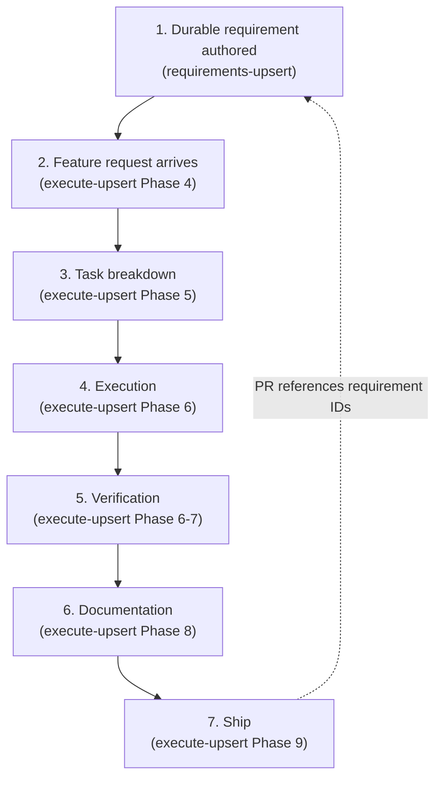

# Formal Requirements Languages — Overview

This reference explains why formal requirements languages were integrated into
the requirements-upsert skill, how they fit into the end-to-end workflow, and
what each tool contributes. It is the single place to understand the
multi-tool strategy: the feature matrix, the workflow diagram, the
non-redundancy map, adoption decisions, and the redundancy watchlist.

## 1. Introduction

The requirements-upsert skill originally relied on free-form prose for
requirements and Gherkin for task acceptance criteria. That works for
authoring and review, but it leaves four gaps that grow as the system scales:

| Gap | Problem without formal languages |
|-----|----------------------------------|
| **Authoring discipline** | Prose requirements are ambiguous — "should", "must", and "will" mean different things to different readers, and vague statements slip through review. |
| **Internal consistency** | Nothing checks whether requirements contradict each other or whether edge cases are covered. `validate-ledger.sh` catches date and orphan issues, not logical contradictions. |
| **Runtime enforcement** | The binding-contract hook is a static convention. There is no machine-readable contract that declares what an agent *must*, *must not*, and *may* do during execution, with explicit severities. |
| **Test scaffold** | Task stories get Gherkin behavioral scenarios but no data-transform examples or machine-generated test cases. Verification is LLM-judged for anything not covered by a script. |

Formal requirements languages close these gaps by constraining authoring
syntax (EARS), providing machine-validated consistency (FSL), formalizing
runtime enforcement (AgentContract), and borrowing structured examples
(Simplex concepts). The result is a stack where each layer is strengthened by
the best external tool for that layer, without adopting a single monolithic
specification language.

## 2. The Workflow (Requirement → Execution → Verification)

The integrated workflow spans seven stages, from durable requirement
authoring through shipping. The requirements-upsert skill owns stage 1; the
execute-upsert skill owns stages 2–7. Formal languages plug in at the stages
where they add the most value.



### Stage 1 — Durable requirement authored (requirements-upsert)

The requirement is written in the ledger using the EARS-constrained Statement
field (one of five fixed sentence templates, all using **SHALL**). The
Rationale and Constraints fields capture context and non-functional
requirements. The Verification table lists how the requirement will be
checked. For provability-critical requirements, an optional parallel `.fsl`
formal spec is authored alongside the ledger entry. The requirement is
snapshotted to `history/` for evolution tracking.

**Formal languages in play**: EARS (authoring syntax), FSL (optional formal
spec).

### Stage 2 — Feature request arrives (execute-upsert Phase 4)

When a feature request arrives, execute-upsert consults the requirements
ledger to find relevant durable requirements. It creates a PRD that
references those requirement IDs, surfaces assumptions, and — when runtime
enforcement is needed — creates or updates a `.contract.yaml` (AgentContract)
that declares must / must-not / may clauses with severities.

**Formal languages in play**: AgentContract (runtime contract).

### Stage 3 — Task breakdown (execute-upsert Phase 5, tasks-from-prd)

The PRD is decomposed into stories with explicit dependencies. Each story
gets sub-tasks with Verify commands. Acceptance criteria are written in
Gherkin (`Given`/`When`/`Then`) for behavioral paths. For data-transform
paths, EXAMPLES (input → expected-output pairs, borrowed from Simplex) are
used instead of or alongside Gherkin. Conditional paths get EXAMPLES that
cover each branch.

**Formal languages in play**: Gherkin (behavioral AC), Simplex EXAMPLES
(data-transform AC).

### Stage 4 — Execution (execute-upsert Phase 6, tasks-processor)

Subagents are dispatched with a binding contract (the `.contract.yaml`
AgentContract file). Each subagent receives the contract, the task story,
and the acceptance criteria. Per-story code review is performed. The
AgentContract's must / must-not / may clauses with severities (warn / block /
rollback / halt) govern what happens when a clause is violated during
execution.

**Formal languages in play**: AgentContract (binding contract, severity
enforcement).

### Stage 5 — Verification (execute-upsert Phase 6–7)

All Verify commands pass. Gherkin acceptance criteria are checked. EXAMPLES
are validated against the implementation. If a `.fsl` spec exists for the
requirement, `fslc verify` runs bounded model checking and k-induction to
prove no contradictions exist within scope. Counterexamples (if any) are
returned as JSON diagnostics for repair. The quality floor
(`quality-gate.sh`) is applied as the deterministic baseline.

**Formal languages in play**: FSL (Z3 BMC + k-induction, counterexamples),
Simplex EXAMPLES (I/O validation), AgentContract (clause enforcement).

### Stage 6 — Documentation (execute-upsert Phase 8)

The PRD is updated to reflect what was built. Changed requirements are
snapshotted to `history/`. The requirements ledger is updated with
supersession links and Change Log entries. The `.contract.yaml` is updated
if the runtime contract changed during execution.

**Formal languages in play**: EARS (ledger consistency), AgentContract
(contract update).

### Stage 7 — Ship (execute-upsert Phase 9)

The branch is pushed, a PR is created, and auto-merge is configured. The PR
body references the requirement IDs from the ledger so the change is
traceable from commit to durable requirement. After merge, control returns
to the main branch.

**Formal languages in play**: Requirement IDs propagate from ledger → PR for
traceability.

## 3. Feature Matrix

The table below compares the current stack and the five external tools across
sixteen capabilities. "Current stack" refers to the integrated
requirements-upsert + execute-upsert pipeline as it exists today.

| Capability | Current stack | EARS | SpeQ | Simplex | AgentContract | FSL |
|---|---|---|---|---|---|---|
| Primary artifact | Markdown ledger + PRD + tasks | Prose constraint (no file) | `.speq` DSL | Semi-structured spec | `.contract.yaml` | `.fsl` formal spec |
| Constrained authoring syntax | Free-form prose + Gherkin at tasks | 5 fixed sentence templates | Purpose-built DSL, parser+validator | 18 uppercase landmarks | YAML schema | Formal grammar (Lark) |
| Closed-world assumption | No | No | Yes | Partial | No | Yes (within scope) |
| Machine-validated consistency | `validate-ledger.sh` (dates + orphans only) | None (lint can check SHALL) | `speq check` | None | Schema validation | Z3 BMC + k-induction |
| Counterexample generation | No | No | No | No | No | Yes (JSON diagnostics) |
| Acceptance criteria format | Gherkin + Verify commands | Implied by pattern | CONTRACTS block | DONE_WHEN + EXAMPLES | must/must-not/may | Properties via BMC |
| Runtime enforcement | Binding-contract hook (static) | None | None | EVAL landmark | warn/block/rollback/halt | No (verification-time) |
| Deterministic vs LLM-judged | Scripts deterministic; review LLM-judged | N/A | speq check deterministic | EVAL implies grader | Explicit split | Deterministic (Z3) |
| Evolution/snapshot tracking | Yes (history/ + supersession + Change Log) | No | state_*.speq (build progress) | BASELINE landmark | version field only | Req IDs propagate via refinement |
| Monorepo/module decomposition | Yes ({proj}/{module}/{slug}) | No | LAYERS + VOCABULARY | No | No | Refinement dialects |
| Cross-artifact linking | see-also in frontmatter | No | CONTRACTS | COVERS | Named assertions | Req IDs propagate |
| Test scaffold generation | No | No | No | EXAMPLES are I/O pairs | No | fslc scenarios |
| Tiered dialects | Partial (PRD→tasks) | No | No | No | No | Yes (consulting/requirements/design) |
| NFRs/SLAs | Free-form in Constraints | Possible via prose | Possible via CONTRACTS | Possible via CONSTRAINT | Quantitative limits | Discrete-time SLAs |
| Agent authoring loop | Agent writes ledger directly | Agent writes EARS prose | speq new/update with AI | Agent writes Simplex | Agent reads contract | Write→verify→repair with JSON |
| Maturity | Production (v1.10.0) | Mature (2009) | Early | v0.6 | Spec exists | Usable, AI-native |
| What it guarantees | Ledger consistency + history preserved | Requirement is unambiguous + test-shaped | Spec grammatically valid + closed-world | Work unit has examples + grading | Runtime violations caught + enforced | No contradictions/counterexamples in scope |

## 4. Non-Redundancy Map

Multi-tool adoption is correct because each tool strengthens a **different
weak layer**. No two tools solve the same problem; they plug into distinct
tiers of the pipeline.

```
Tier            Current stack              Best external fit
─────────────────────────────────────────────────────────
Authoring       Free-form prose    ←──  EARS (constrained prose)
syntax          + Gherkin at tasks

Architecture    PRD (NL)           ←──  SpeQ (closed-world DSL) [NOT ADOPTING — watch]
contract

Work-unit       Task stories       ←──  Simplex (EXAMPLES + EVAL concepts)
spec            + Gherkin AC

Runtime         Binding-contract   ←──  AgentContract (must/must-not/may
enforcement     hook                    + severity enforcement)

Verifiable      (none — review     ←──  FSL (Z3 BMC + counterexamples
proof           is LLM-judged)          + test scaffold gen)
```

Reading the map top to bottom: EARS fixes authoring ambiguity, SpeQ would fix
architecture-contract gaps (but is not mature enough to adopt), Simplex
concepts fix the work-unit test-scaffold gap, AgentContract fixes runtime
enforcement, and FSL fixes the verifiable-proof gap. Each tier maps to exactly
one external tool — there is no overlap in the problem each tool solves.

## 5. Adoption Decisions

The table below records what was adopted, where it plugs in, the cost, and
what it buys.

| Adopt | Plug-in point | Cost | What it buys |
|---|---|---|---|
| EARS | Rewrite requirement-template.md Statement/Constraints; add linter rule | Low (template edit + linter) | Eliminates vague requirements at authoring time |
| FSL | Optional parallel .fsl spec for provability-critical subset only | Medium (new file type, fslc binary, agent skill) | Machine-checked consistency + counterexample-driven repair + test scaffolds for requirements that need proof |
| AgentContract | Formalize binding-contract hook as .contract.yaml with must/must-not/may + severities | Medium (formalize what's already informal) | Per-run enforcement with explicit severity policy |
| Simplex concepts | Borrow EXAMPLES + EVAL into task template | Low (template edit) | Closes test-scaffold gap without new format |
| SpeQ | NOT ADOPTING — watch | — | — |

### Why SpeQ is not adopted

SpeQ provides a closed-world DSL with `speq check` validation — valuable for
architecture contracts. However, it is early-stage, introduces a new file
format and parser dependency, and overlaps with the PRD layer that is already
serving the architecture-contract role. The cost outweighs the benefit at
current maturity. It remains on the watchlist; if the PRD layer proves
insufficient for complex multi-module systems, SpeQ is the candidate to
reevaluate.

## 6. Redundancy Watchlist

Several tools have overlapping surface area. The distinctions below prevent
duplication. When two tools touch the same concern, one must **reference** the
other, not re-implement it.

### 1. EARS linter vs validate-ledger.sh

These are **non-overlapping**. The EARS linter checks authoring syntax (the
five sentence templates, SHALL modal verb). `validate-ledger.sh` checks
structural integrity (dates, orphan references). Consolidate the **invocation**
(both run from the same validate script), not the **logic** — each checker
owns its own domain.

### 2. AgentContract clauses vs quality-gate.sh

AgentContract declares *what* must be true at runtime (must / must-not / may
clauses with severities). `quality-gate.sh` is the *deterministic check
implementation* for many of those clauses. AgentContract clauses that map to
a quality-gate check should **reference** `quality-gate.sh` as the
implementation, not re-implement the check inline. The contract is the policy;
the script is the enforcement.

### 3. AgentContract LLM-judged clauses vs code-review-guidance skill

Some AgentContract clauses are inherently LLM-judged (e.g., "code follows
project conventions"). These clauses should **reference** the
code-review-guidance skill as the evaluation authority, not duplicate the
review checklist inside the contract. The contract declares the clause; the
review skill defines how it is evaluated.

### 4. Simplex EXAMPLES vs Gherkin AC

Gherkin (`Given`/`When`/`Then`) is for **behavioral paths** — sequences of
actions and observable outcomes. EXAMPLES (input → expected-output pairs) are
for **data-transform paths** — functions that map inputs to outputs. Do not
require both for the same path. A behavioral scenario does not need EXAMPLES,
and a pure data transform does not need Gherkin. Use the format that matches
the path type.

### 5. FSL scenarios vs task Verify commands

If a requirement has a `.fsl` formal spec, `fslc` can generate test scenarios
from the spec's properties. Task Verify commands for that requirement should
**reference** the FSL-generated scenarios, not re-derive test cases manually.
The `.fsl` spec is the source of truth for provability-critical requirements;
Verify commands call into `fslc` rather than duplicating the proof logic.
