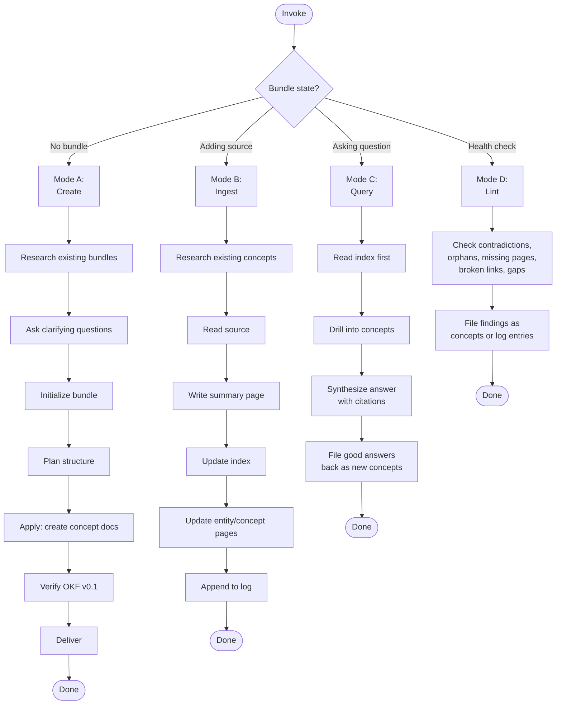

---

---
description: Base AI guidance include that bundles common templates for all AI guidance types
---

---
description: Self-update requirement template for AI guidance files to track usage for maintenance and cleanup
---

### Self-Update Requirement

**CRITICAL**: When this guidance file is called, you MUST update the `last-used` field in this file's front-matter to the current date (YYYY-MM-DD format) before proceeding with any other work. This tracks usage for maintenance and cleanup purposes.


---

---
description: Shared CLI tool discovery — run cli-tool-discovery.sh to find and run tools through environment wrappers and standard PATH locations before giving up. Also resolves the canonical ad-hoc runner for an ecosystem (python/node/rust/go) via --runner.
---

### CLI Tool Discovery

Before concluding a CLI tool is unavailable, run `cli-tool-discovery.sh`. It
detects environment wrappers (devbox, mise, flox, direnv, nix), searches 30+
standard PATH locations, checks package managers (brew, mise, asdf), and
accounts for the project's tech stack — all in one pass. **Never give up on
the first `command -v` failure.**

For ad-hoc package execution (e.g. `uvx`, `pnpm dlx`, `cargo binstall`, `go
install`), use `--runner <ecosystem>` instead of resolving the binary and
hardcoding the invocation. The runner mode is the single source of truth for
"how do I invoke an ad-hoc command in ecosystem X?" — it pairs the binary
resolution with the canonical invocation pattern from the tech-stack table.

#### Get the script

```bash
# Skills: the script is materialized into scripts/cli-tool-discovery.sh at build time
bash scripts/cli-tool-discovery.sh <tool-name>

# Workflows, agents, and rules (no scripts/ directory): fetch from the public releases repo
curl -fsSL https://raw.githubusercontent.com/levonk/skills-releases/main/includes/cli-tool-discovery.sh -o /tmp/cli-tool-discovery.sh
bash /tmp/cli-tool-discovery.sh <tool-name>
```

#### Usage

```bash
# Resolve only — print where the tool is or how to run it
cli-tool-discovery.sh <tool-name>          # text output
cli-tool-discovery.sh <tool-name> --json   # JSON output (for scripts)

# Resolve and exec — runs the tool through the right wrapper/path, never returns
cli-tool-discovery.sh -- <tool-name> [args...]

# Resolve the ad-hoc runner for an ecosystem (JSON only)
cli-tool-discovery.sh --runner <python|node|rust|go>
```

#### Output (resolve mode)

| Output | Meaning | Action |
|--------|---------|--------|
| `FOUND: <path>` | Tool found at a specific path | Use that path directly |
| `WRAPPER: <wrapper-cmd>` | Tool is inside an environment wrapper | Run via the wrapper (e.g. `devbox run -- <tool>`) |
| `NOT_FOUND: <tool>` | Tool not found anywhere | Install it (ask user first) |

In exec mode (`--`), the script resolves the tool and replaces itself with
the tool process — stdout/stderr/exit code pass through directly. If the tool
is inside a wrapper, it execs through the wrapper. If not found, exits 127.

#### Output (runner mode)

`--runner <ecosystem>` emits JSON only:

```json
{
  "ecosystem": "python",
  "binary": "uv",
  "binary_status": "found",
  "binary_path": "/usr/local/bin/uv",
  "wrapper": "",
  "script": "uv run --script",
  "package": "uvx",
  "fallback": "pip install + python3",
  "fallback_runner": "python3",
  "recommendation": ""
}
```

| Field | Meaning |
|-------|---------|
| `binary` | The canonical binary for the ecosystem (`uv`, `pnpm`/`bun`, `cargo`, `go`) |
| `binary_status` | `found` (use `binary_path`), `wrapper` (use `wrapper`), `not_found` (use `fallback`/`recommendation`) |
| `script` | The runner for inline-metadata scripts (PEP 723). Empty for ecosystems without an equivalent. |
| `package` | The runner for ad-hoc package execution (`uvx`, `pnpm dlx`, `bunx`, `cargo binstall -y`, `go install`) |
| `fallback` | The fallback approach when the binary is not found (e.g. `pip install + python3`). Empty if no fallback exists. |
| `fallback_runner` | The command to use for the fallback. Empty if no fallback exists. |
| `recommendation` | When `binary_status` is `not_found`: either "add to devbox.json", "use fallback", or "install manually". Empty otherwise. |

Ecosystem mapping:

| Ecosystem | Binary | Script runner | Package runner | Fallback |
|-----------|--------|---------------|----------------|----------|
| `python` | `uv` | `uv run --script` | `uvx` | `pip install + python3` |
| `node` (host) | `pnpm` | — | `pnpm dlx` | none (install pnpm) |
| `node` (container) | `bun` | — | `bunx` | none |
| `rust` | `cargo` | — | `cargo binstall -y` | `cargo install` |
| `go` | `go` | — | `go install` | none |

Container detection for `node`: checks `/.dockerenv`, `$DOCKER_CONTAINER`, or
container markers in `/proc/1/cgroup`. This matches the tech-stack table's
"inside a container → bunx" rule.

The Python include (`cli-tool-discovery.py.tmpl`) provides `resolve_runner(ecosystem)`
returning the same dict shape, for use inside Python scripts that need to
discover the runner programmatically.

#### When to Use

- **Always**, before reporting a tool as "not found" or "not installed"
- When a build/test/lint command fails with "command not found"
- When a skill or workflow script needs a tool that isn't on PATH
- When the user reports a tool "should be installed" but `command -v` fails
- **For ad-hoc package execution**, use `--runner <ecosystem>` instead of
  hardcoding `uvx` / `pnpm dlx` / `cargo binstall` / `go install` — the
  runner mode keeps the binary resolution and the invocation pattern paired
  and consistent with the tech-stack table

#### Anti-Patterns

- **Giving up on first `command -v` failure** — run the script instead
- **Installing a tool without asking** — always confirm before adding packages
- **Ignoring environment wrappers** — if a `devbox.json` exists, the tool is
  likely inside devbox, not on the bare shell
- **Hardcoding `uvx` / `pnpm dlx` / `cargo binstall` / `go install`** — use
  `--runner <ecosystem>` instead so the binary and invocation stay paired
  and the policy lives in one place (the tech-stack table, mirrored by the
  runner mode)


---
description: Shared reference resolution — run scripts/resolve-reference.sh to resolve links to other skills and knowledge bundles in any deploy context
---

### Reference Resolution

When a skill or knowledge bundle needs content from another skill or knowledge
bundle, do **not** use bare relative paths like `../../knowledge/foo/overview.md`
or `../other-bundle/overview.md`. Those paths break the moment the artifact is
installed standalone via `pnpm dlx skills add`.

Instead, use the three-tier fallback resolver: `scripts/resolve-reference.sh`.
It tries three resolution strategies in order:

1. **Local relative path** — finds the target file in the source tree
   (`src/<ref>` or `<ref>`) by walking up from the current directory. Works in
   development and full-profile installs.
2. **Remote fetch** — downloads the target file from the published distribution
   repo (`levonk/skills-releases` for public content, `levonk/skills-private`
   for private content). Works for online standalone installs.
3. **Materialized copy** — reads the target file from
   `references/included/<ref>` inside the current skill/bundle. Populated at
   build time with the templater's `includeTree` function. Works for offline
   standalone installs.

#### Use in skills

For skills that reference knowledge bundles or other skills:

1. Add `scripts/resolve-reference.sh` to the skill by creating a
   `scripts/resolve-reference.sh.tmpl` file containing a single include directive
   using the project's `/` delimiters. In rendered guidance this is shown
   with `{{`/`}}` to avoid delimiter leakage:

   ```
   {{ include "includes/resolve-reference.sh" . }}
   ```

2. If the skill's workflow needs the referenced content at runtime (offline,
   no network), materialize the dependency with `includeTree`:

   ```
   {{ includeTree "knowledge/<bundle-name>/" . }}
   ```

   This copies the bundle under
   `<skill>/references/included/knowledge/<bundle-name>/` at build time. The
   resolver checks this location as tier 3.

3. Reference the dependency through the resolver:

   ```bash
   scripts/resolve-reference.sh knowledge/<bundle-name>/overview.md
   ```

#### Use in knowledge bundles

Knowledge bundles do not have a `scripts/` directory. Cross-bundle links should
be rewritten to published URLs at build time. Intra-bundle links (e.g.
`overview.md` → `mermaidjs.md`) remain relative and work in all deploy contexts.

#### Using the resolver from markdown

When authoring a skill, replace relative links with resolver calls or links to
the materialized copy. Examples:

- Old (broken after standalone install):
  `[diagram practices](knowledge/documentation-diagram-practices/overview.md)`
- With `includeTree` (recommended for runtime content):
  Add `{{ includeTree "knowledge/documentation-diagram-practices/" . }}` to
  the SKILL.md, then link to the materialized copy:
  `[diagram practices](references/included/knowledge/documentation-diagram-practices/overview.md)`
- Direct resolver call (for scripts):
  `bash scripts/resolve-reference.sh knowledge/documentation-diagram-practices/overview.md`

#### Resolver syntax

```bash
# Print content to stdout
scripts/resolve-reference.sh knowledge/foo/overview.md

# Force a specific tier (useful for testing)
scripts/resolve-reference.sh knowledge/foo/overview.md --tier 3

# Write content to a file
scripts/resolve-reference.sh knowledge/foo/overview.md --out /tmp/foo.md
```

#### When to materialize with includeTree

- The skill's workflow applies the dependency's content at runtime (e.g. the
  AUTHOR phase reads syntax conventions from the bundle).
- The dependency is small and stable.
- The user may run the skill offline.

Do **not** materialize when:

- The reference is attribution-only ("this skill is related to that bundle").
- The dependency is huge and the skill only points at it for background.
- The user is always online and the URL fallback is sufficient.

For attribution-only references, use a URL to the published repo instead:
`https://github.com/levonk/skills-releases/blob/main/knowledge/<bundle-name>/overview.md`.


---
description: Base template for creating AI guidance files (skills, workflows, agents, prompts) with shared principles and patterns
---

### AI Guidance Creation Framework

This framework provides shared principles and patterns for creating AI guidance files across all types: skills, workflows, agents, and prompts.

## Universal Creation Process

At a high level, the process of creating AI guidance goes like this:

1. **DECONSTRUCT**: Identify the domain expertise and use cases
2. **UNDERSTAND**: Gather concrete examples of usage
3. **PLAN**: Analyze examples for reusable components
4. **INITIALIZE**: Create the guidance structure
5. **DEVELOP**: Implement the guidance content
6. **TEST**: Run evals with-guidance vs baseline
7. **ITERATE**: Refine based on evaluation results
8. **PACKAGE**: Prepare for distribution

## Step 1: Capture Intent

Start by understanding the user's intent. The current conversation might already contain a workflow the user wants to capture (e.g., they say "turn this into a skill"). If so, extract answers from the conversation history first — the tools used, the sequence of steps, corrections the user made, input/output formats observed.

Ask these questions:
1. What should this guidance enable the AI to do?
2. When should this guidance trigger? (what user phrases/contexts)
3. What's the expected output format?
4. Should we set up test cases to verify the guidance works?

**Test case guidance**: Guidance with objectively verifiable outputs (file transforms, data extraction, code generation, fixed workflow steps) benefits from test cases. Guidance with subjective outputs (writing style, art) often doesn't need them. Suggest the appropriate default based on the guidance type, but let the user decide.

## Step 2: Interview and Research

Proactively ask about edge cases, input/output formats, example files, success criteria, and dependencies. Wait to write test prompts until you've got this part ironed out.

Check available MCPs - if useful for research (searching docs, finding similar guidance, looking up best practices), research in parallel via subagents if available.

**To avoid overwhelming users**, avoid asking too many questions in a single message. Start with the most important questions and follow up as needed for better effectiveness.

Conclude this step when there is a clear sense of the functionality the guidance should support.

## Step 3: Plan Reusable Guidance Contents

Analyze each concrete example by:
1. Considering how to execute the example from scratch
2. Identifying what scripts, references, and assets would be helpful when executing these workflows repeatedly

**Example**: For a pdf-editor guidance to handle "Help me rotate this PDF":
- Rotating a PDF requires re-writing the same code each time
- A `scripts/rotate_pdf.py` script would be helpful

**Example**: For a frontend-webapp-builder guidance for "Build me a todo app":
- Writing a frontend webapp requires the same boilerplate HTML/React each time
- An `assets/hello-world/` template containing the boilerplate would be helpful

**Example**: For a big-query guidance for "How many users have logged in today?":
- Querying BigQuery requires re-discovering table schemas each time
- A `references/schema.md` file documenting the table schemas would be helpful

## Step 4: Initialize the Guidance Structure

**Skip this step only if the guidance being developed already exists, and iteration or packaging is needed. In this case, continue to the next step.**

When creating new guidance from scratch, use the appropriate initialization script or template:

**For skills:**
```bash
python scripts/init_skill.py <skill-name> --path <output-directory>
```

**For workflows/agents/prompts:**
Use the appropriate template from `config/ai/templates/meta/` or create from the base frontmatter template.

The initialization creates:
- Guidance directory with proper structure
- Main file template with proper frontmatter and TODO placeholders
- Example resource directories: `scripts/`, `references/`, and `assets/`
- Example files in each directory that can be customized or deleted

Customize or remove the generated example files as needed.

### Scaffolder Script Pattern

When creating an upsert skill that scaffolds other artifacts (agents, AGENTS.md
hierarchies, workflows, prompts), use a **scaffolder script** that reads from a
**template file** in `references/` — do NOT embed template content inline in the
script. The script handles deterministic substitutions; the template holds the
structure.

**Pattern:**
1. Create a plain template file in `references/` (e.g., `agent-scaffold-template.md`)
   with placeholder markers like `<agent-name>`, `<YYYY-MM-DD>`, `<Skill Title>`
2. The scaffolder script loads the template file and performs string substitution
   on the deterministic placeholders (dates, names, slugs)
3. All other fields remain as TODO placeholders for the author to fill in
4. The script does NOT embed template content — it reads from the template file

**Why template files, not embedded templates:**
- The template is editable independently of the script
- No duplication between the script and the references directory
- The template can be reviewed and tested separately
- Changes to the template don't require changing the script

**Examples:**
- `ai-skill-upsert/scripts/init_skill.py` loads `references/skill-template.md`
- `agent-upsert/scripts/init-agent.py` loads `references/agent-scaffold-template.md`
- `agent-file-upsert/scripts/init-agents-md.py` loads `references/AGENT-project-*-template.md.tmpl`

**When a scaffolder is needed:** When there is deterministic structure to create
(directory hierarchy, multiple files with known relationships, placeholder
substitution). When the artifact is a single file with no deterministic
substitution, a template file alone (without a script) may suffice.

## Step 5: Develop the Guidance Content

### Degrees of Freedom Framework

Match the level of specificity to the task's fragility and variability:

- **High freedom** (text-based instructions): Use when multiple approaches are valid, decisions depend on context, or heuristics guide the approach.
- **Medium freedom** (pseudocode or scripts with parameters): Use when a preferred pattern exists, some variation is acceptable, or configuration affects behavior.
- **Low freedom** (specific scripts, few parameters): Use when operations are fragile and error-prone, consistency is critical, or a specific sequence must be followed.

Think of the AI as exploring a path: a narrow bridge with cliffs needs specific guardrails (low freedom), while an open field allows many routes (high freedom).

### Progressive Disclosure

Guidance uses a three-level loading system:

1. **Metadata** (name + description) - Always in context (~100 words)
2. **Body** - In context whenever guidance triggers (<500 lines ideal)
3. **Bundled resources** - As needed (unlimited, scripts can execute without loading)

**Key patterns:**
- Keep body under 500 lines; if approaching this limit, add hierarchy with clear pointers
- Reference files clearly from body with guidance on when to read them
- For large reference files (>300 lines), include a table of contents

### Description Writing

**Front-load leading words**: Start description with the most important trigger words. The AI reads descriptions left-to-right and matches on early words.

**One trigger per branch**: Each distinct trigger phrase should have its own branch in the description. Don't try to combine multiple triggers in one phrase.

**Add negative-trigger guards**: Pushy descriptions over-trigger. After the positive triggers, add a "Do NOT trigger on..." clause listing the cases where the skill would waste effort — factual questions with one right answer, pure creation tasks, summary/processing tasks, or anything a lighter skill handles better. This clause does two things: (1) helps the AI decide not to invoke the skill, and (2) feeds the trigger-guard include's "explain why" step when the skill is triggered anyway.

**Example good description:**
```
Create new skills, modify and improve existing skills, and measure skill performance. Use when users want to create a skill from scratch, edit or optimize an existing skill, run evals to test a skill, benchmark skill performance with variance analysis, or optimize a skill's description for better triggering accuracy. Do NOT trigger on general coding questions, bug fixes, or feature implementation — this skill is for skill lifecycle management, not general development.
```

**Example bad description:**
```
A comprehensive skill management system for creating, editing, testing, and optimizing AI skills with various evaluation and benchmarking capabilities.
```

### Trigger Guard Include

Every skill with a "pushy" description should wire in the trigger-guard include so over-triggering doesn't waste effort:

```
---
description: Reusable trigger guard — when a skill is triggered but the question is a poor fit, answer without the skill, explain why, and offer a rerun on a one-word affirmative
---

### Trigger Guard

If this skill is triggered but the question is a poor fit for it — for example, the question matches one of the "Do NOT trigger on..." cases in this skill's description — follow this protocol:

1. **Answer the question directly.** Do not invoke this skill's process, scripts, or multi-step workflow. Provide the best answer you can without the skill.

2. **Explain briefly that the answer was provided without the skill and why.** One or two sentences. Reference the specific reason from the description's negative-trigger clause. Examples:
   - "Answered without the council because this is a factual question with one right answer — the multi-perspective process wouldn't add value."
   - "Answered without peer-review because there's only one response to review — anonymization and comparison need multiple inputs."
   - "Answered without briefingmemo because this is a fast pressure-test, not a high-stakes strategic decision needing research and governance — use think-assist instead."

3. **Offer a rerun.** Tell the user: "If you'd like to run this through the full skill process anyway, respond with `go`." Use `go` as the suggested affirmative — one word, unambiguous, fast to type.

4. **On `go`, run the skill.** If the user responds with `go` (or any clear affirmative), execute the full skill process regardless of the initial guard assessment. The user's explicit request overrides the guard.

**Why this guard exists:** Skills with "pushy" descriptions over-trigger on questions they can't add value to. The guard prevents wasted effort (running a 5-advisor council on "what's the capital of France") while respecting explicit user intent — if the user wants the heavy process run anyway, one word gets it done.

```

Place it right after the `base-ai-guidance` include. The guard protocol: when triggered but the question is a poor fit, answer without the skill, explain why (referencing the description's "Do NOT trigger on..." clause), and offer a rerun on a one-word affirmative (`go`). The user's explicit request always overrides the guard.

### Information Hierarchy

**In-skill steps**: Step-by-step instructions that fit in the main body
**In-skill reference**: Quick reference tables or summaries
**External reference**: Detailed documentation in separate files

**When to use each:**
- In-skill steps: Core workflow that's always needed
- In-skill reference: Frequently needed information (parameter lists, error codes)
- External reference: Detailed implementation guides, troubleshooting procedures

### Context Management

**Declare context at the bottom**: All file paths, URLs, and project-specific information should be declared at the bottom of the file in a Context Declaration section. This preserves AI cache capability.

**Use indirect references**: Instead of hardcoding full paths like `/Users/micro/p/gh/levonk/dotfiles/...`, use indirect references like "the project's AGENTS.md" or "the skill's references directory".

**Never leak the user's home directory**: A guidance file must never contain an absolute home path like `/Users/johndoe/...`, `/home/johndoe/...`, or `C:\Users\johndoe\...`. These bake in the current author's username, break for every other user/machine, and leak PII. Rules, in order of preference:

1. Use an indirect reference ("the project's AGENTS.md", "the skill's references directory").
2. Use a repo-relative path (`config/ai/skills/...`).
3. Only if a home path is truly unavoidable, use `~/` (e.g. `~/.config/...`) — never the literal home directory of any specific user.

When upserting an existing skill, treat any `/Users/<name>/`, `/home/<name>/`, or `C:\Users\<name>\` occurrence as stale text and replace it with `~/` (or an indirect reference if the path is repo-internal).

**Example:**
```markdown
## Context Declaration

### File Paths
- Main guidance: `config/ai/skills/ai/ai-skill-upsert/SKILL.md`
- References: `config/ai/skills/ai/ai-skill-upsert/references/`

### External Resources
- Documentation: https://example.com/docs
```

## Step 6: Test and Iterate

### Evaluation Framework

**When to test:**
- Skills with objectively verifiable outputs (file transforms, data extraction, code generation)
- Workflows with specific success criteria
- Agents with defined capabilities

**When testing is optional:**
- Creative tasks (writing style, art)
- Advisory tasks (strategic advice, recommendations)

**Testing approach:**
1. Create baseline test cases
2. Run with guidance vs without guidance
3. Measure improvement in:
   - Accuracy (correctness of output)
   - Efficiency (time to completion)
   - Consistency (repeatability of results)
4. Iterate based on results

### Pruning Techniques

**Single source of truth**: Ensure each piece of information exists in exactly one place. Reference it rather than duplicating.

**No-op hunting**: Identify and remove instructions that don't actually change behavior. If the AI would do it anyway, remove the instruction.

**Leading words**: Ensure descriptions start with the most important trigger words for better matching.

### Failure Modes

**Premature completion**: Guidance that stops before the task is complete. Add verification steps.

**Duplication**: Same information repeated in multiple places. Consolidate to single source.

**Sediment**: Old, outdated information that's no longer relevant. Remove or update.

**Sprawl**: Guidance that grows beyond 500 lines without hierarchy. Add structure and references.

**No-op**: Instructions that don't change behavior. Remove unnecessary guidance.

## Type-Specific Considerations

### Skills
- Focus on specialized workflows and domain expertise
- Include bundled resources (scripts, references, assets)
- Use progressive disclosure for complex information
- Keep body under 500 lines

### Workflows
- Define clear phases (Initialize, Plan, Apply, Verify, Deliver)
- Specify concurrency and safety controls
- Include step-by-step execution guidance
- Document tool usage and dependencies

### Agents
- Define role and capabilities clearly
- Specify input/output schemas
- Include runtime constraints
- Document integration points

### Prompts
- Focus on specific task patterns
- Include template variables
- Document expected inputs and outputs
- Provide usage examples

## Communicating with the User

The guidance creator is used by people across a wide range of technical familiarity. Pay attention to context cues to adjust your communication:

- "evaluation" and "benchmark" are borderline but OK
- For "JSON" and "assertion", wait for cues that the user knows these terms before using them without explanation

It's OK to briefly explain terms if you're in doubt. Feel free to clarify with short definitions.


---
description: Core content principles for AI guidance files - token efficiency, progressive disclosure, quality guidelines
---

### Core Content Principles

#### Token Efficiency

The context window is a public good. AI guidance files share the context window with system prompt, conversation history, other guidance metadata, and the actual user request.

**Default assumption**: The AI is already very smart. Only add context the AI doesn't already have. Challenge each piece of information:

- "Does the AI really need this explanation?"
- "Does this paragraph justify its token cost?"

**Guidelines:**
- Prefer concise examples over verbose explanations
- Use progressive disclosure to defer detailed information
- Reference external resources instead of duplicating content
- Use indirect references (e.g., "the project's AGENTS.md") instead of full paths
- Use ~ to represent the user's home directory in paths
- Create information dense content that maximizes value per token

#### Progressive Disclosure

AI guidance uses a three-level loading system:

1. **Metadata** (always loaded) - Frontmatter name + description (~100 words)
2. **Body** (loaded when triggered) - Main instructions (<500 lines ideal)
3. **Resources** (loaded as needed) - Reference files, scripts, templates (unlimited)

**Implementation Patterns:**

**Keep body concise:**
- If approaching 500 lines, add hierarchy with clear pointers
- For large reference files (>300 lines), include a table of contents
- Move detailed examples to reference files

**Reference file structure:**
```markdown
## Detailed Reference: [Topic]

For comprehensive information on [topic], see: `references/[topic].md`

### Quick Reference
- Key point 1
- Key point 2

### When to Read Full Reference
- When you need detailed implementation guidance
- When troubleshooting complex issues
- When extending or modifying the core functionality
```

**Context declaration pattern:**
Place all file paths, URLs, and project-specific context at the bottom of the file to preserve AI cache capability:

```markdown
---
## Context Declaration

### File Paths
- Main skill: `config/ai/skills/category/skill-name/SKILL.md`
- References: `config/ai/skills/category/skill-name/references/`
- Templates: `config/ai/skills/category/skill-name/templates/`

### External Resources
- Documentation: https://example.com/docs
- API reference: https://api.example.com

### Project Information
- Project: my-project
- Repository: https://github.com/user/repo
```

#### Quality Guidelines

**Clarity over cleverness:**
- Use clear, direct language
- Avoid jargon unless necessary and explained
- Provide concrete examples

**Actionable guidance:**
- Prefer "do X" over "consider doing X"
- Include copy-paste ready commands
- Specify exact file paths when possible

**Validation and testing:**
- Define success criteria
- Include verification steps
- Specify test commands

**Error handling:**
- Document common failure modes
- Provide troubleshooting guidance
- Include recovery procedures

#### Audience Separation

When serving multiple audiences, use progressive disclosure to separate concerns:

**Example: Boilerplate repository**
```markdown
## Using Boilerplates

For deploying existing boilerplates, see: [Quick Start Guide](docs/quick-start.md)

For creating or modifying boilerplates, see: [Boilerplate Development Guide](docs/development.md)
```

**Implementation:**
- Keep common information in the main file
- Move audience-specific information to separate files
- Use clear pointers to guide each audience

#### Conflict and Duplication Prevention

**Check for conflicts:**
- Review existing guidance before creating new
- Ensure no contradictory instructions
- Validate consistency across related files

**Avoid duplication:**
- Reference existing content instead of duplicating
- Use jinja templating to share common patterns
- Create base templates for repeated structures

**General over specific:**
- Use indirect references instead of hardcoded paths
- Prefer patterns over specific solutions
- Design for flexibility when possible

#### Jinja Templating Usage

**When to use jinja:**
- Sharing common patterns across multiple files
- Reducing duplication of frontmatter or structure
- Creating variable-based content (paths, URLs, versions)

**When NOT to use jinja:**
- When content is unique to a single file
- When templating adds complexity without benefit
- When content changes frequently

**Pattern:**
```jinja2
{{ include "includes/base-frontmatter.md" . }}

{{ include "includes/base-content-principles.md" }}

## Skill-Specific Content
[Your unique content here]

---
## Context Declaration
{{ include "includes/context-declaration.md" . }}
```


---
description: Guidance for delegating work to subagents with reduced initial memory — front-load context, review results, and choose serialization vs parallelization deliberately
---

### Subagent Delegation

When the runtime supports subagents that start with a reduced (or fresh) context window, prefer delegation over doing the work in the orchestrator's context. The orchestrator's context is a scarce, shared resource; a subagent's fresh context is cheap and disposable.

#### Step Marker: `[fork]`

A workflow or skill author can tag a step with `[fork]` to signal that this step is a strong delegation candidate. The marker is a pointer, not a directive — it says "consider forking this to a subagent" without restating the full guidance below.

**When you see `[fork]` on a step:** apply the delegation protocol in this include (front-load context, review the result, choose serialization vs parallelization for any sibling `[fork]` steps).

**When authoring — mark a step with `[fork]` only if:**

- The step is self-contained (a subagent can complete it without asking back).
- The step is context-heavy (doing it in the orchestrator would burn context the orchestrator needs later).
- The step has a clear deliverable the orchestrator can review.

Do NOT mark every step. Steps needing orchestrator judgment, iterative back-and-forth, or cross-step state belong in the orchestrator — marking those `[fork]` is noise.

**Example:**

```markdown
1. Read the user's request and identify the target module.
2. `[fork]` Search the codebase for all callers of `parseConfig()` and return the file:line list.
3. Based on the caller list, decide which callers need updating.
4. `[fork]` For each caller identified in step 3, apply the signature change and run its targeted test.
```

Steps 2 and 4 are marked: both are self-contained, context-heavy, and have reviewable deliverables. Step 3 is not — it's the orchestrator's judgment call using step 2's output. Step 4 forks are parallelizable (independent callers), but each depends on step 3's decision, so they serialize after step 3.

#### When to Delegate

Delegate when the work is **self-contained** — the subagent can complete it without asking clarifying questions back. Subagents are stateless: they cannot see the orchestrator's context and cannot prompt for clarification. If a task needs iterative back-and-forth, do it in the orchestrator.

Good delegation candidates: a bounded search, a file transform with a known shape, a single function implementation, a review of a specific diff, a one-shot investigation with a defined deliverable.

#### Front-Load the Starting Context

A subagent succeeds or fails on the prompt it's given. Before dispatching, assemble a complete starting context:

- **Goal**: what the subagent should produce, in one sentence.
- **Inputs**: exact file paths, symbol names, line ranges, or URLs it should read. Don't make it search for what you already know.
- **What's already known**: findings the orchestrator has already established that the subagent would otherwise re-derive.
- **Constraints**: conventions to follow, what NOT to touch, output format expected.
- **What to return**: the specific artifact or answer shape the orchestrator needs back.

If you can't write this prompt confidently, the task isn't ready to delegate — finish scoping it in the orchestrator first.

#### Review the Subagent's Work

Delegation is not abdication. After the subagent returns:

1. **Verify the deliverable** against the goal stated in the prompt. Check it actually does what was asked, not just what was literally typed.
2. **Check the blast radius**: did it edit only what was intended? Grep callers of any function it touched.
3. **Run the smallest check that would fail if the work is wrong** — typecheck, a targeted test, or an assert-based self-check.
4. **Re-dispatch only the failing slice** if the result is partially correct. Don't re-run the whole task for one fix.

#### Serialization vs Parallelization

Choose deliberately, not by default:

- **Parallel** when tasks are independent (no shared output, no read-after-write dependency between them). Launch all in one batch and collect results as they complete. Example: reviewing three unrelated PRs, searching three unrelated code areas.
- **Serial** when one task's output is another's input, or when tasks write to the same files/state. Running them in parallel produces conflicts or wasted work. Example: implement, then test the implementation, then refactor based on test results.

When unsure, ask: "does task B need to read what task A produced?" If yes, serialize. If no, parallelize.

#### Anti-Patterns

- **Vague dispatch**: "investigate the auth flow" with no file paths. The subagent re-explores what the orchestrator already knows.
- **Delegating the decision, not the work**: asking a subagent to "decide the approach" when the orchestrator should own strategy. Delegate execution, keep judgment.
- **Parallelizing dependent tasks**: spawning implement + test simultaneously, then the test runs against code that doesn't exist yet.
- **Serializing independent tasks "to be safe"**: three independent searches run one-after-another when they could have run concurrently. Costs 3x the wall time for no safety gain.
- **Skipping review**: trusting the subagent's self-report without running a check. The subagent's "done" and the orchestrator's "correct" are different bars.


---
description: Reusable user-reference convention — use male pronouns for the user, address him as "user", avoid proper names unless relevant to the output
---

---
description: Shared DO/DON'T icon convention — ✅ for recommended practices, ❌ for anti-patterns. Use in patterns-and-conventions sections, examples, and guidance lists.
---

# DO / DON'T Icon Convention

Use these icons consistently when presenting recommended practices and
anti-patterns. The pairing makes correct and incorrect approaches visually
scannable side-by-side.

| Icon | Meaning | Usage |
|---|---|---|
| ✅ | **DO** — recommended practice | Lead the line with `✅ **DO**:` followed by the practice |
| ❌ | **DON'T** — anti-pattern | Lead the line with `❌ **DON'T**:` followed by the anti-pattern |

## Formatting Rules

- Place the icon at the start of the line, before any bold label.
- Use `**DO**` / `**DON'T**` (bold, uppercase) as the label — not "Do" / "Don't"
  or "GOOD" / "BAD".
- Keep each item to one sentence; put the rationale after an em dash (`—`).
- Group all ✅ items together, then all ❌ items — do not interleave.

## Example

```markdown
✅ **DO**: Use `/` delimiters in `.tmpl` files
✅ **DO**: Guard against missing commands with `command -v`

❌ **DON'T**: Use `{{`/`}}` — they won't parse under custom delimiters
❌ **DON'T**: Assume a tool is installed without checking
```

## Variants

The same icons are used in example-contrast pairs (Weak vs Strong, Bad vs Good)
without the **DO**/**DON'T** labels:

```markdown
❌ **Weak:** "We need more time."
✅ **Strong:** "To hit the quality bar, we have three paths: ..."
```

When used this way, keep the ❌/✅ pairing adjacent so the contrast is immediate.


### User Info

When communicating with or about the user, follow this convention:

1. **Male pronouns.** Refer to the user with `he`/`him`/`his`/`himself` in any
   prose, examples, or generated content that mentions the user. Do not use
   `they`/`them` or `she`/`her` for the user.

2. **Address him as "user".** Call the user "user" — even when his real name is
   available in memory, environment variables, git config, or session context.
   The word "user" is the canonical form of address in generated output and
   in-conversation references.

3. **Avoid proper names unless relevant to the output.** Do not insert the
   user's actual name into generated artifacts or conversation unless the name
   is itself the subject of the work (e.g. authoring an `AUTHORS` file, signing
   a commit the user explicitly asked to be attributed to him, or filling a
   `name:` field the user requested). When a name is required and none is
   explicitly requested, use "user".

**Examples:**
- ✅ "The user wants his skill to trigger on kebab-case slugs."
- ✅ "Ask the user for his repo root before materializing the script."
- ❌ "They want their skill to trigger on kebab-case slugs." (wrong pronoun)
- ❌ "Ask John for his repo root." (proper name not relevant to output)


---
description: Reusable naming conventions for artifacts created by upsert skills — kebab-case for file names, identifiers, and slugs; avoid snake_case everywhere
---

---
description: Shared DO/DON'T icon convention — ✅ for recommended practices, ❌ for anti-patterns. Use in patterns-and-conventions sections, examples, and guidance lists.
---

# DO / DON'T Icon Convention

Use these icons consistently when presenting recommended practices and
anti-patterns. The pairing makes correct and incorrect approaches visually
scannable side-by-side.

| Icon | Meaning | Usage |
|---|---|---|
| ✅ | **DO** — recommended practice | Lead the line with `✅ **DO**:` followed by the practice |
| ❌ | **DON'T** — anti-pattern | Lead the line with `❌ **DON'T**:` followed by the anti-pattern |

## Formatting Rules

- Place the icon at the start of the line, before any bold label.
- Use `**DO**` / `**DON'T**` (bold, uppercase) as the label — not "Do" / "Don't"
  or "GOOD" / "BAD".
- Keep each item to one sentence; put the rationale after an em dash (`—`).
- Group all ✅ items together, then all ❌ items — do not interleave.

## Example

```markdown
✅ **DO**: Use `/` delimiters in `.tmpl` files
✅ **DO**: Guard against missing commands with `command -v`

❌ **DON'T**: Use `{{`/`}}` — they won't parse under custom delimiters
❌ **DON'T**: Assume a tool is installed without checking
```

## Variants

The same icons are used in example-contrast pairs (Weak vs Strong, Bad vs Good)
without the **DO**/**DON'T** labels:

```markdown
❌ **Weak:** "We need more time."
✅ **Strong:** "To hit the quality bar, we have three paths: ..."
```

When used this way, keep the ❌/✅ pairing adjacent so the contrast is immediate.


### Naming Conventions

When creating or renaming artifacts (skills, workflows, agents, prompts,
rules, templates, knowledge bundles, handoffs), follow this naming convention:

1. **Use kebab-case whenever possible.** File names, directory names, slugs,
   identifiers, frontmatter `name:` fields, tags, and URL/path segments are all
   `kebab-case`: lowercase letters and digits separated by single hyphens.
   - ✅ `ai-skill-upsert`, `greenfield-prd`, `feature-auth-implementation`
   - ✅ `name: agent-file-upsert`
   - ✅ tag: `ai/skill`

2. **Avoid snake_case everywhere.** Do not use `snake_case` (`_` separators) for
   artifact names, file names, slugs, identifiers, or frontmatter fields. If an
   existing artifact uses snake_case and the upsert operation touches its name,
   rename it to kebab-case (preserving git history via `git mv` where applicable).
   - ❌ `ai_skill_upsert`, `greenfield_prd`, `feature_auth_implementation`
   - ❌ `name: agent_file_upsert`

3. **Scope.** This convention applies to the artifacts themselves — the files
   and directories the upsert skills create. It does **not** override language-
   specific conventions inside generated *content* (Python function names stay
   `snake_case`, Rust types stay `PascalCase`, etc.). The rule is about the
   artifact layer, not the code inside artifacts.

4. **Slugs in generated paths.** When a script generates a path containing a
   human-readable slug (e.g. handoff file names, branch names, output
   directories), derive the slug as kebab-case: lowercase, trim, replace
   whitespace and `_` with `-`, collapse repeats, strip leading/trailing `-`.

**Examples:**
- ✅ `skills/ai/agent-file-upsert/SKILL.md` — `name: agent-file-upsert`
- ✅ `workflows/greenfield-prd/WORKFLOW.md` — `name: greenfield-prd`
- ❌ `skills/ai/agent_file_upsert/SKILL.md` — `name: agent_file_upsert`


---
description: Reusable trigger guard — when a skill is triggered but the question is a poor fit, answer without the skill, explain why, and offer a rerun on a one-word affirmative
---

### Trigger Guard

If this skill is triggered but the question is a poor fit for it — for example, the question matches one of the "Do NOT trigger on..." cases in this skill's description — follow this protocol:

1. **Answer the question directly.** Do not invoke this skill's process, scripts, or multi-step workflow. Provide the best answer you can without the skill.

2. **Explain briefly that the answer was provided without the skill and why.** One or two sentences. Reference the specific reason from the description's negative-trigger clause. Examples:
   - "Answered without the council because this is a factual question with one right answer — the multi-perspective process wouldn't add value."
   - "Answered without peer-review because there's only one response to review — anonymization and comparison need multiple inputs."
   - "Answered without briefingmemo because this is a fast pressure-test, not a high-stakes strategic decision needing research and governance — use think-assist instead."

3. **Offer a rerun.** Tell the user: "If you'd like to run this through the full skill process anyway, respond with `go`." Use `go` as the suggested affirmative — one word, unambiguous, fast to type.

4. **On `go`, run the skill.** If the user responds with `go` (or any clear affirmative), execute the full skill process regardless of the initial guard assessment. The user's explicit request overrides the guard.

**Why this guard exists:** Skills with "pushy" descriptions over-trigger on questions they can't add value to. The guard prevents wasted effort (running a 5-advisor council on "what's the capital of France") while respecting explicit user intent — if the user wants the heavy process run anyway, one word gets it done.


---
description: Shared research phase rules — when to search, gap assessment, create-vs-reuse decision, and how to incorporate findings. Each consumer adds its own artifact-specific search tactics (inline or via a type-specific include).
---

# Research Phase: Search Before You Create or Improve

Before creating or improving any AI guidance artifact, research what already
exists. This prevents duplicating effort, ensures new artifacts incorporate
the best ideas from existing work, and surfaces existing artifacts the user
could adopt instead of creating from scratch.

## When to Run

- **Always**, unless the user explicitly says "skip research", "don't
  search", or "just create it"
- Before **creating** a new artifact (skill, workflow, agent, prompt, template,
  knowledge bundle)
- Before **improving** an existing artifact — to understand the landscape and
  avoid regressing below the state of the art

If the user provides an existing file to convert or update, the research phase
still applies: check whether better alternatives exist that the user could
adopt instead of converting/updating their current file.

## Anti-Pattern and Inferior-Solution Discovery

As part of researching existing artifacts, also search for **anti-patterns**
and **inferior solutions** — approaches that were tried and found harmful or
worse than the current approach. These are negative findings: things NOT to
do, or approaches that are known to be inferior.

Sources to check:
- **Git history**: commits that reverted or removed an approach (revert
  commits, "remove X" commits, "switch from X to Y" commits)
- **Issue trackers**: closed issues labeled "wontfix" or "invalid" where an
  approach was rejected, with rationale
- **ADR / OOS files**: architecture decisions that explicitly rejected an
  alternative; out-of-scope files that document what the repo does NOT do
- **Existing anti-patterns files**: `internal-docs/anti-patterns/` if it
  exists — check the INDEX.md for previously recorded anti-patterns
- **Code comments**: `// HACK`, `// FIXME`, `// TODO: replace`, `// DEPRECATED`
  markers that signal known-bad approaches
- **External research**: blog posts, discussions, or documentation that
  describe why an approach is inferior (when the artifact type warrants it)

Record discovered anti-patterns clearly marked as negative — they must never
be mistaken for positive recommendations. If the consumer skill produces an
anti-patterns file (see `agent-file-upsert`), write findings there. Otherwise,
note them in the research summary with explicit "❌ DO NOT" framing.

## Artifact-Specific Search

Each artifact type has different search tactics. See the consumer's own
section below (inline or via a type-specific include) for how to search for
that artifact type. The gap assessment and decision framework that follow
apply to all artifact types.

## Gap Assessment

After researching, determine whether there's a gap:

| Situation | Gap? | Action |
|---|---|---|
| No existing artifacts found | Yes — clear gap | Proceed to create |
| Artifacts found but none cover the user's need | Yes — coverage gap | Proceed to create, incorporating best ideas |
| Artifacts found, partially cover the need | Yes — scope gap | Proceed to create, noting what existing artifacts miss |
| Artifacts found, fully cover the need | No gap | Offer to adopt the best match (see below) |
| Multiple artifacts found, each covers part | Partial gap | Consider creating one that combines the best parts |

### What Counts as "Fully Covered"

A need is fully covered when an existing artifact:
1. Addresses the user's specific use case (not just a related one)
2. Has acceptable quality (structured, maintained, has evals/tests)
3. Matches the user's constraints (language, platform, distribution)
4. Is installable and usable by the user

If any of these fail, there's at least a partial gap.

## Decision: Create vs Reuse

### If there IS a gap

Present the findings to the user:
- What artifacts exist and what they cover
- What's missing (the gap)
- How the new artifact would be better

Then offer to create. The user's ideas/constraints + best practices the LLM
knows + the best ideas from existing artifacts all feed into the new
artifact's design.

### If there is NO gap

Present the best existing artifact(s) with:
- Name, description, and link (so the user can investigate themselves)
- Why it fits the user's need
- Any caveats (quality, maintenance, scope limitations)

Then ask the user:
1. **Adopt the existing artifact?** — Provide the install/usage command.
2. **Still create a new one?** — The user may have reasons to create their
   own (customization, learning, different constraints). Respect their choice
   and proceed with creation.

### If the user wants to investigate

Always provide links so the user can investigate existing artifacts themselves
before deciding. Do not make the decision for them — present the evidence and
let them choose.

## Incorporating Findings

When proceeding to create after finding existing artifacts:

1. **Note the best ideas**: What did existing artifacts do well? (structure,
   patterns, reference organization, eval design)
2. **Note the gaps**: What did existing artifacts miss? This is the value
   proposition of the new artifact.
3. **Note the user's ideas/constraints**: What does the user want that
   existing artifacts don't address?
4. **Apply best practices**: Use the LLM's knowledge of design best practices
   for the artifact type.
5. **Synthesize**: Combine all three inputs (existing ideas + gap filling +
   best practices) into the new artifact's design.

The new artifact should be **better than any single existing artifact** — not
just different. If it's merely a reimplementation, reconsider whether creation
is warranted.


---
description: Reusable cross-linking guidance for AI guidance artifacts — see-also frontmatter format, relationship types, and circular dependency avoidance
---

### Cross-Linking

When an AI guidance artifact references other artifacts (skills, workflows, rules,
prompts, templates, agents):

1. **Use `see-also` in frontmatter**: Document every relationship to other
   artifacts. The `see-also` field is an array of entries, each with:
   - `template`, `skill`, `workflow`, or `rule` — the artifact kind
   - `relationship` — the relationship type (see below)
   - `description` — one line explaining the relationship

2. **Specify relationship type**: Use one of:
   - `dependency` — this artifact requires the other to function
   - `alternative` — this artifact can be used instead of the other
   - `complement` — this artifact works alongside the other
   - `sibling` — this artifact is in the same family/category

3. **Explain the relationship**: The `description` field should make clear why
   the relationship exists and when a user would follow the link. One line is
   enough.

4. **Avoid circular dependencies**: Artifacts should not depend on each other
   bidirectionally. If A depends on B, B should not also depend on A — restructure
   so the dependency flows one direction, or use `complement`/`sibling` for the
   reverse link.

**Example `see-also` entry:**
```yaml
see-also:
  - skill: "readme-upsert"
    relationship: "sibling"
    description: "Same upsert family — handles README.md creation and updates"
```


---
description: Reusable date management guidance for upsert operations — when to update date.updated and date.last-used in frontmatter
---

### Date Management

AI guidance artifacts track two dates in their frontmatter under the `date:` key:

| Field | When to update | Meaning |
|-------|----------------|---------|
| `date.updated` | When content changes are applied | Last time the artifact's content was modified |
| `date.last-used` | When the artifact is invoked | Last time the artifact was actually used |

**Format**: Both dates use `YYYY-MM-DD` as a quoted string in YAML:
```yaml
date:
  updated: "2026-07-11"
  last-used: "2026-07-11"
```

**When updating an existing artifact (Mode C):**
- Set `date.updated` to the current date when you apply content changes.
- Set `date.last-used` to the current date when the skill is invoked (even if no
  changes are made).

**Relationship to `self-update-requirement`:**
The `self-update-requirement` include handles the invocation-time `last-used`
update — it fires every time the skill is called. This include handles the
change-time `updated` update, which only fires when content is actually modified.
Both should be wired into upsert skills: `self-update-requirement` for
invocation tracking, this include for change tracking.


---
description: Shared clarifying-questions protocol — ask numbered, outcome-framed multiple-choice questions before generating or updating any artifact, until complete clarity is achieved. Use decision briefs for trade-offs and high-stakes ambiguity. Generic across all generative skills.
---

### Clarifying Questions (Mandatory Before Generation)

Before generating or updating an artifact, ask clarifying questions until you
have complete clarity on what the user wants. Only ask about gaps that
materially affect the output — skip questions where the answer is already clear
from the prompt, the codebase, or prior context.

Frame every question in outcome terms: what pain is avoided, what capability
unlocks, or what user experience changes if the artifact is right.

#### What to Ask About

Ask about gaps in any of these areas (only the ones that are unclear):

- **Problem / goal** — What is the user trying to achieve?
- **Core functionality** — What should the artifact do or contain?
- **Scope boundaries** — What is explicitly in scope and out of scope?
- **Success criteria** — How will the user know the output is correct?
- **Target audience** — Who is the primary consumer of the output?
- **Priority / effort** — Is this P1 (critical), P2 (high), or P3 (medium)?
- **Constraints** — Known dependencies, deadlines, or technical constraints?
- **Existing context** — Are there designs, tickets, specs, or prior work to incorporate?

#### Standard Question Format

- Number questions: `1.`, `2.`, `3.`, etc.
- Provide multiple-choice options per question: `A.`, `B.`, `C.`, `D.`, ...
- Make it easy for the user to reply like: `1A, 2C, 3B`.
- Keep questions concise — one sentence per question.
- 2–4 options per question (never more than 5).
- Include an "Other" implication: the user can always write a custom answer
  instead of picking a letter.

#### Decision Brief Format (for Trade-Offs and High-Stakes Ambiguity)

When a question is a genuine choice among options with different coverage,
risk, or effort, or when the wrong answer would materially change the output,
package it as a decision brief:

- **D<N> — <one-line title>** (e.g. `D1 — Target output format`)
- **ELI10:** 1–2 plain-English sentences that name the choice and the stakes.
- **Stakes if we pick wrong:** One sentence on what breaks, what the user sees,
  or what is lost.
- **Recommendation:** `Option because reason` (e.g. `B because it keeps the
  artifact portable without extra dependencies`). Put the `(recommended)` label
  on that option.
- **Completeness:** `A=X/10, B=Y/10, ...` when options differ in coverage (10 =
  complete, 7 = happy path, 3 = shortcut). If options differ in kind, write:
  `Note: options differ in kind, not coverage — no completeness score.`
- **Options:** `A)`, `B)`, `C)`, `D)` — each with at least one `✅` pro and one
  `❌` con, each concrete and ≥40 characters. For one-way / destructive choices
  the option may be a hard-stop escape.
- **Net:** One-line synthesis of the trade-off.

For **one-way / destructive** decisions (e.g. deleting files, overwriting
published artifacts, forcing branch changes, irreversible scope cuts), require
explicit typed confirmation beyond the letter. State plainly what is
irreversible and ask for the exact option word or letter before proceeding.

#### Example Question Format (for standard clarifying questions)

```text
1. What is the primary goal of this feature?
   A. Improve user onboarding experience
   B. Increase user retention
   C. Reduce support burden
   D. Generate additional revenue

2. Who is the target user for this feature?
   A. New users only
   B. Existing users only
   C. All users
   D. Admin users only

3. What is the priority level for this feature?
   A. P1 - Critical, needs immediate attention
   B. P2 - High priority, next sprint
   C. P3 - Medium priority, backlog
```

#### When to Stop Asking

- Stop when you have enough clarity to produce a correct, complete artifact.
- For high-stakes ambiguity (architecture, scope, data model, destructive
  actions, missing context), STOP. Name the ambiguity in one sentence, present
  2–3 options with trade-offs, and ask.
- Do not ask more than 7 questions in a single round — if you need more, batch
  them and let the user answer what they can.
- If the user's initial prompt is already detailed and unambiguous, you may ask
  only 1–2 confirmation questions or skip straight to generation with a brief
  summary of your understanding.

#### After the User Answers

- Synthesize the answers into a brief understanding statement before proceeding.
- If any answer is ambiguous or contradicts another answer, ask one focused
  follow-up question.
- Then proceed to the next phase (research, generation, etc.) — do not re-ask
  questions already answered.


# Knowledge Bundle Upsert

A skill for creating and maintaining OKF knowledge bundles across their full
lifecycle. A knowledge bundle is a persistent, compounding artifact — not a
one-time deliverable. This skill covers four modes: **Create**, **Ingest**,
**Query**, and **Lint**.

## Overview

### Three-Layer Architecture

OKF bundles operate within a three-layer architecture:

1. **Raw sources** — your curated collection of source documents. Articles,
   papers, images, data files. These are immutable — you read from them but
   never modify them. This is your source of truth.

2. **The bundle (wiki)** — a directory of markdown concept files following OKF
   v0.1. Summaries, entity pages, concept pages, comparisons, an overview, a
   synthesis. The agent owns this layer entirely. It creates pages, updates
   them when new sources arrive, maintains cross-references, and keeps
   everything consistent. You read it; the agent writes it.

3. **The schema** — the skill files (this one) that tell the agent how the
   bundle is structured, what the conventions are, and what workflows to follow
   when ingesting sources, answering questions, or maintaining the bundle. You
   and the agent co-evolve this over time as you figure out what works for your
   domain.

## Decision: Which Mode

Before starting, determine which mode applies:

1. **No bundle exists yet** → **Mode A: Create** — scaffold a new OKF bundle.
2. **Bundle exists, adding a new source** → **Mode B: Ingest** — process a new
   source into the existing bundle.
3. **Bundle exists, asking a question** → **Mode C: Query** — answer a question
   using the bundle, then file good answers back.
4. **Bundle exists, health check** → **Mode D: Lint** — check for
   contradictions, orphans, missing pages, and broken links.

## Workflow Diagram



## Mode A: Create

Create a new OKF-compliant knowledge bundle from scratch.

0. **Research existing bundles**: Run the research phase before creating. Skip
   only if the user explicitly says "skip research" or "don't search".

   **Bundle-specific search** — check whether a bundle already exists for the
   target domain:
   - Search the target knowledge directory for existing `index.md` or `log.md`
     files.
   - Check for existing OKF bundles in the workspace.
   - If a bundle already covers the domain, offer to adopt or extend it instead
     of creating a new one.

1. **Ask clarifying questions** (per the clarifying-questions include): Confirm
   the knowledge domain, concept types, organizational structure, and target
   directory before generating.

2. **Initialize**: Define bundle purpose, scope, and target directory. See
   `references/bundle-structure.md` for the directory layout and reserved
   filenames.

3. **Plan**: Design the directory structure and concept types. Extract
   concepts, not pages — a single source document may produce many concept
   files. One concept per file. See `references/okf-spec.md` for the OKF v0.1
   design principles and core concepts.

4. **Apply**: Create the bundle:
   - Create the bundle directory structure
   - Create concept documents with proper frontmatter (see
     `references/concept-documents.md` for frontmatter fields, body structure,
     and cross-linking)
   - Add `index.md` files for progressive disclosure (see
     `references/index-files.md`)
   - Establish cross-links between related concepts
   - Create `log.md` for update history (see `references/log-files.md`)

5. **Verify**: Validate OKF v0.1 conformance (see `references/okf-spec.md` —
   OKF v0.1 Conformance Criteria):
   - Every non-reserved `.md` file has parseable YAML frontmatter
   - Every frontmatter has a non-empty `type` field
   - Reserved filenames follow their specified structure

6. **Deliver**: Save the bundle to the knowledge directory. Point the user to
   `references/example-concepts.md` for resource-bound and abstract concept
   examples, and `references/best-practices.md` for type naming, progressive
   disclosure, and maintenance guidance.

## Mode B: Ingest

Add a new source to an existing bundle. See `references/operations.md` for the
full ingest workflow, supervision levels, and bundle-specific search tactics.

High-level steps:

1. **Research before adding**: Check `index.md` for existing concepts, grep the
   bundle for related keywords, and check for contradictions with existing
   pages.
2. **Read the source** and discuss key takeaways (optional, depending on
   supervision level).
3. **Write a summary page** in the bundle.
4. **Update the index** (`index.md`).
5. **Update relevant entity and concept pages** across the bundle — a single
   source might touch 10-15 pages.
6. **Append an entry to the log** (`log.md`).

Extract concepts, not pages — one concept per file.

## Mode C: Query

Ask questions against the bundle. See `references/operations.md` for the full
query workflow.

High-level steps:

1. **Read the index first** to find relevant pages.
2. **Drill into the relevant concept documents**.
3. **Synthesize an answer with citations** — answers can take different forms
   (markdown page, comparison table, chart).
4. **File good answers back** — a comparison, analysis, or discovered connection
   should be filed into the bundle as a new concept document so explorations
   compound.

## Mode D: Lint

Periodically health-check the bundle. See `references/operations.md` and
`references/best-practices.md` for the full lint checklist.

Look for:

- **Contradictions** between pages (newer sources superseding stale claims)
- **Orphan pages** with no inbound links
- **Missing pages** — important concepts mentioned in prose but lacking their
  own page
- **Missing cross-references** between related concepts
- **Broken links** that should be filled (not-yet-written knowledge that has
  become relevant)
- **Data gaps** that could be filled with a web search or a new source

File lint findings as new concept documents or log entries.

## Cross-bundle References

When a bundle references another knowledge bundle, use one of these strategies
so links stay valid after standalone deployment:

- **Attribution / see-also only**: Add the bundle to the frontmatter `see-also`
  list or use a URL to the published repo
  (`https://github.com/levonk/skills-releases/blob/main/knowledge/<bundle-name>/overview.md`).
  No local files are needed.
- **Runtime content needed offline**: If the bundle's workflow depends on the
  referenced bundle content, materialize it with `includeTree` at build time:
  ```
  {{ includeTree "knowledge/<bundle-name>/" . }}
  ```
  This copies the bundle to `references/included/knowledge/<bundle-name>/`. Link
  to the materialized copy or call `scripts/resolve-reference.sh <ref>` from any
  script the bundle includes.
- **Intra-bundle links**: Links between files inside the same bundle (e.g.
  `overview.md` to `mermaidjs.md`) remain relative — they work in all deploy
  contexts.

`knowledge-bundle-upsert` keeps `scripts/resolve-reference.sh` materialized so
bundle authors can use the three-tier resolver when building tooling around a
bundle.

## Citations

[1] [LLM Wiki pattern (Andrej Karpathy)](https://gist.github.com/karpathy/442a6bf555914893e9891c11519de94f)
[2] [OKF v0.1 Specification](https://github.com/GoogleCloudPlatform/knowledge-catalog/blob/main/okf/SPEC.md)
[3] [OKF introduction (Google Cloud blog)](https://cloud.google.com/blog/products/data-analytics/how-the-open-knowledge-format-can-improve-data-sharing)

## Context Declaration

### File Paths
- Main skill: `src/current/skills/ai/knowledge-bundle-upsert/SKILL.md` (in the `skills-src` repo at `~/p/gh/levonk/skills-src/`)
- References: `src/current/skills/ai/knowledge-bundle-upsert/references/` (including `okf-spec.md`, `bundle-structure.md`, `concept-documents.md`, `index-files.md`, `log-files.md`, `best-practices.md`, `example-concepts.md`, `operations.md`)
- Includes: `src/current/includes/` (shared includes wired into this skill)

### External Resources
- OKF v0.1 Specification: https://github.com/GoogleCloudPlatform/knowledge-catalog/blob/main/okf/SPEC.md
- OKF introduction: https://cloud.google.com/blog/products/data-analytics/how-the-open-knowledge-format-can-improve-data-sharing
- LLM Wiki pattern (Andrej Karpathy): https://gist.github.com/karpathy/442a6bf555914893e9891c11519de94f
- Reference implementations: https://github.com/GoogleCloudPlatform/knowledge-catalog

### Project Information
- Project: levonk/skills-src
- Repository: https://github.com/levonk/skills-src
- Owner: levonk

<!-- vim: set ft=markdown -->
