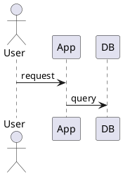
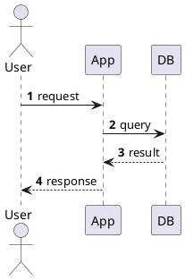

```plantuml
@startsalt
{
  Login: { "username" | "password" | [Submit] }
}
@endsalt
```

# PlantUML Practices

## Practice

PlantUML is the tool of choice for **precise UML** (class, state, component,
deployment, sequence diagrams) where Mermaid's vocabulary is too limited. It
renders from text (`@startuml`/`@enduml` blocks) via a server or local jar.

### 1. Always wrap diagrams in `@startuml`/`@enduml`

Even when embedding in a code fence, wrap the diagram in `@startuml`/`@enduml`.
Some renderers (Obsidian plugin, VS Code preview) require it; others
(plantuml.com web) are lenient. Wrapping is always safe:

````markdown

````

### 2. Prefer the local jar over plantuml.com for air-gapped / private repos

The public `plantuml.com` server sees the text of every diagram rendered
through it. For proprietary or sensitive content, use the local jar:

```bash
# Install once
brew install plantuml          # macOS
# or: download plantuml.jar from https://plantuml.com/download

# Render
java -jar plantuml.jar diagram.puml -o ./out
java -jar plantuml.jar -tpng diagram.puml   # PNG output
java -jar plantuml.jar -tsvg diagram.puml   # SVG output (preferred for docs)
```

SVG is preferred for documentation — it scales without pixelation and is
diffable in git (text-based XML).

### 3. Let auto-layout handle positioning

PlantUML's auto-layout (Graphviz/dot under the hood) is good. Avoid manual
positioning hints (`skinparam`, `together`, `ltoR`) unless the diagram is
genuinely unreadable — manual hints make the source harder to edit and often
look worse than auto-layout.

### 4. Use `salt` for wireframes

For UI wireframes (not full UML), PlantUML's `salt` syntax is a text-based
alternative to Excalidraw:

````markdown

````

### 5. Keep sequence diagrams under ~15 participants

Sequence diagrams with 15+ participants become unreadable. Split into multiple
diagrams by sub-system, or use `group`/`alt`/`loop` blocks to organize
interactions within one diagram.

### 6. Use `autonumber` for sequence diagrams

Numbering steps makes the diagram referenceable in prose ("see step 7 in the
sequence diagram"):



## Why

PlantUML's richer UML vocabulary (proper class diagrams with visibility
modifiers, state machines with nested states, component diagrams with ports)
makes it the right tool for detailed design docs where Mermaid's simplified
syntax would lose information. The text-based source is diffable in git, unlike
Excalidraw's JSON.

The `@startuml`/`@enduml` wrapping and local-jar practices avoid two common
failure modes: renderers that silently drop unwrapped diagrams, and leaking
proprietary diagram content to the public plantuml.com server.

## When this practice applies

- Detailed design docs requiring precise UML notation.
- Sequence diagrams with `alt`/`loop`/`group` blocks.
- Class diagrams with visibility, generics, and relationships.
- State machine diagrams with nested states.
- Air-gapped or proprietary environments where diagram content must not leave
  the network.

## When this practice does NOT apply

- **Simple flowcharts / decision trees** — use Mermaid (renders inline in more
  environments, see [Mermaid Practices](mermaidjs.md)).
- **Whiteboard sketches** — use Excalidraw (see
  [Excalidraw Practices](excalidraw.md)).
- **UI mockups** — use Figma or a dedicated UI tool; `salt` is for quick
  wireframes only.

## See Also

- [Diagram Tool Selection](diagram-tool-selection.md) — when to pick PlantUML
  over Mermaid or Excalidraw.
- [Mermaid Practices](mermaidjs.md) — the inline-rendering alternative for
  simpler diagrams.
- [Excalidraw Practices](excalidraw.md) — the hand-drawn alternative for
  whiteboard sessions.
- [dev-environment-practices](../dev-environment-practices/overview.md) —
  installing the PlantUML jar and Graphviz dependency.

## Sources

- PlantUML official docs — https://plantuml.com/
- Common rendering environments: Obsidian plugin, VS Code PlantUML extension,
  plantuml.com server, local jar.
