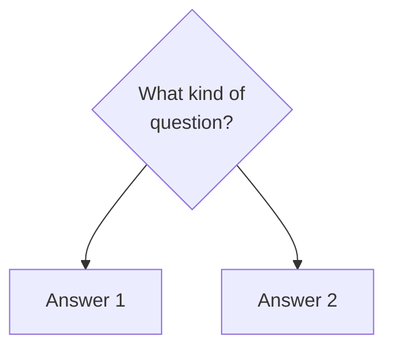

# Mermaid Syntax Practices (Reference Pointer)

The canonical Mermaid syntax conventions live in the knowledge bundle. **Read
the bundle page before authoring a Mermaid diagram** — this file is a pointer,
not a restatement.

## Canonical Source

[`knowledge/documentation-diagram-practices/mermaidjs.md`](../included/knowledge/documentation-diagram-practices/mermaidjs.md)

## Summary (for quick orientation only)

The most common footgun (from ADR-20260520001) is **unquoted decision node
labels containing ` ` or parentheses**. Markdown pre-processors strip
` ` to a literal newline, then `(` on the next line is parsed as a
parenthesis-start token, causing `Expecting 'SQE', got 'PS'` errors.

**Fix**: quote every decision node label that contains ` ` or special
characters using Mermaid's `{"..."}` syntax:

The full quoting rules, ` ` handling, ✅/❌ examples, and renderer-specific
quirks are in the bundle page — read it.

## Why this is a pointer

The bundle is the single source of truth. Restating the rules here would
cause drift. When the bundle updates, this pointer stays valid.
