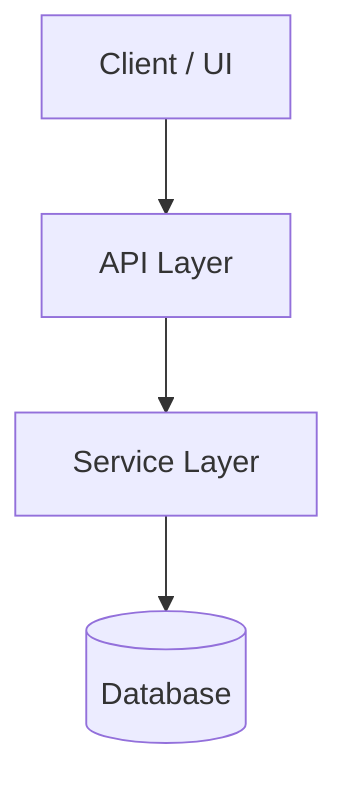
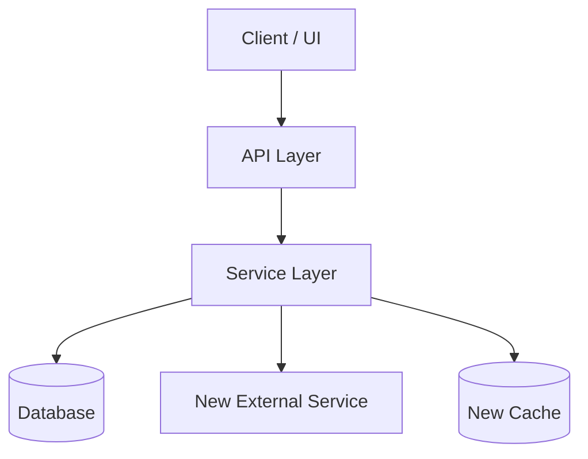
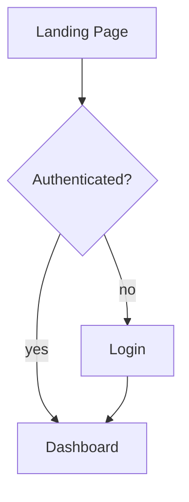
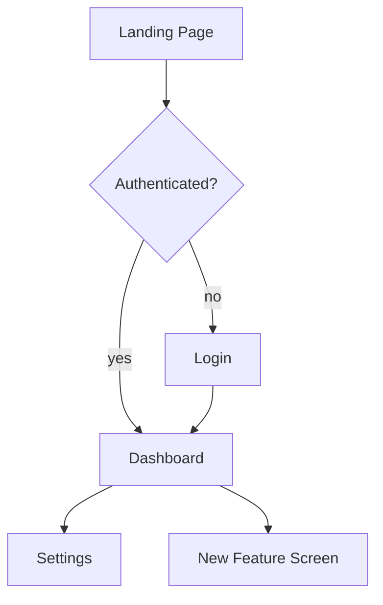

---
description: Guidance for delegating work to subagents with reduced initial memory — front-load context, review results, and choose serialization vs parallelization deliberately
---

### Subagent Delegation

When the runtime supports subagents that start with a reduced (or fresh) context window, prefer delegation over doing the work in the orchestrator's context. The orchestrator's context is a scarce, shared resource; a subagent's fresh context is cheap and disposable.

#### Step Marker: `[fork]`

A workflow or skill author can tag a step with `[fork]` to signal that this step is a strong delegation candidate. The marker is a pointer, not a directive — it says "consider forking this to a subagent" without restating the full guidance below.

**When you see `[fork]` on a step:** apply the delegation protocol in this include (front-load context, review the result, choose serialization vs parallelization for any sibling `[fork]` steps).

**When authoring — mark a step with `[fork]` only if:**

- The step is self-contained (a subagent can complete it without asking back).
- The step is context-heavy (doing it in the orchestrator would burn context the orchestrator needs later).
- The step has a clear deliverable the orchestrator can review.

Do NOT mark every step. Steps needing orchestrator judgment, iterative back-and-forth, or cross-step state belong in the orchestrator — marking those `[fork]` is noise.

**Example:**

```markdown
1. Read the user's request and identify the target module.
2. `[fork]` Search the codebase for all callers of `parseConfig()` and return the file:line list.
3. Based on the caller list, decide which callers need updating.
4. `[fork]` For each caller identified in step 3, apply the signature change and run its targeted test.
```

Steps 2 and 4 are marked: both are self-contained, context-heavy, and have reviewable deliverables. Step 3 is not — it's the orchestrator's judgment call using step 2's output. Step 4 forks are parallelizable (independent callers), but each depends on step 3's decision, so they serialize after step 3.

#### When to Delegate

Delegate when the work is **self-contained** — the subagent can complete it without asking clarifying questions back. Subagents are stateless: they cannot see the orchestrator's context and cannot prompt for clarification. If a task needs iterative back-and-forth, do it in the orchestrator.

Good delegation candidates: a bounded search, a file transform with a known shape, a single function implementation, a review of a specific diff, a one-shot investigation with a defined deliverable.

#### Front-Load the Starting Context

A subagent succeeds or fails on the prompt it's given. Before dispatching, assemble a complete starting context:

- **Goal**: what the subagent should produce, in one sentence.
- **Inputs**: exact file paths, symbol names, line ranges, or URLs it should read. Don't make it search for what you already know.
- **What's already known**: findings the orchestrator has already established that the subagent would otherwise re-derive.
- **Constraints**: conventions to follow, what NOT to touch, output format expected.
- **What to return**: the specific artifact or answer shape the orchestrator needs back.

If you can't write this prompt confidently, the task isn't ready to delegate — finish scoping it in the orchestrator first.

#### Review the Subagent's Work

Delegation is not abdication. After the subagent returns:

1. **Verify the deliverable** against the goal stated in the prompt. Check it actually does what was asked, not just what was literally typed.
2. **Check the blast radius**: did it edit only what was intended? Grep callers of any function it touched.
3. **Run the smallest check that would fail if the work is wrong** — typecheck, a targeted test, or an assert-based self-check.
4. **Re-dispatch only the failing slice** if the result is partially correct. Don't re-run the whole task for one fix.

#### Serialization vs Parallelization

Choose deliberately, not by default:

- **Parallel** when tasks are independent (no shared output, no read-after-write dependency between them). Launch all in one batch and collect results as they complete. Example: reviewing three unrelated PRs, searching three unrelated code areas.
- **Serial** when one task's output is another's input, or when tasks write to the same files/state. Running them in parallel produces conflicts or wasted work. Example: implement, then test the implementation, then refactor based on test results.

When unsure, ask: "does task B need to read what task A produced?" If yes, serialize. If no, parallelize.

#### Anti-Patterns

- **Vague dispatch**: "investigate the auth flow" with no file paths. The subagent re-explores what the orchestrator already knows.
- **Delegating the decision, not the work**: asking a subagent to "decide the approach" when the orchestrator should own strategy. Delegate execution, keep judgment.
- **Parallelizing dependent tasks**: spawning implement + test simultaneously, then the test runs against code that doesn't exist yet.
- **Serializing independent tasks "to be safe"**: three independent searches run one-after-another when they could have run concurrently. Costs 3x the wall time for no safety gain.
- **Skipping review**: trusting the subagent's self-report without running a check. The subagent's "done" and the orchestrator's "correct" are different bars.


---
description: Shared clarifying-questions protocol — ask numbered, outcome-framed multiple-choice questions before generating or updating any artifact, until complete clarity is achieved. Use decision briefs for trade-offs and high-stakes ambiguity. Generic across all generative skills. Builds on the lightweight ask-user base protocol.
---

---
description: Shared ask-user protocol — anytime the AI has a question for the user, present the question, a recommendation, and the reasoning. Lightweight default for general project work; clarifying-questions.md escalates from this base for artifact generation.
---

### Ask the User (Question + Recommendation + Why)

Anytime you have a question for the user — mid-task, at a decision point, or
when ambiguity blocks progress — present it as **question + recommendation +
why**, in that order. Do not ask a bare question and wait. The user should be
able to reply with a single letter, a "yes/no", or "go ahead" without typing
out the reasoning himself.

#### Required Format

For each question, present:

1. **The question** — one sentence, plain language. Number it if there is
   more than one.
2. **Recommendation** — the option you would pick, labeled `(recommended)`.
   If you genuinely don't have a recommendation, say so and explain why
   (e.g. "no recommendation — both options are reasonable for your use
   case, depends on X").
3. **Why** — one or two sentences on the trade-off. Name what breaks, what
   is gained, or what is lost if the user picks the other option.

#### Example (single question)

```text
Q1. Should I add the new helper to the existing `utils.ts` or create a
    separate `helpers/` directory?

    Recommendation: B (separate `helpers/` directory) — recommended
    Why: `utils.ts` is already 600 lines and growing. Splitting now keeps
    each file under the 500-line guideline and makes the new helpers
    discoverable. The cost is one extra import path.
```

#### Example (multiple questions)

```text
Q1. Which auth flow should I implement first?
    A. Email + password (recommended) — fastest to ship, covers the
       happy path; can layer OAuth on top later.
    B. OAuth-only — better security posture upfront, but blocks the
       demo for users without a Google/GitHub account.

Q2. Should the audit log live in the same DB as the app data?
    A. Same DB (recommended) — simpler transactions, one connection
       pool; acceptable until write volume forces a split.
    B. Separate DB — cleaner isolation, but adds a second connection
       pool and a cross-store consistency problem.
```

#### When to Escalate

This is the **base** protocol — use it for ordinary mid-task decisions. For
high-stakes trade-offs (architecture, data model, destructive actions,
one-way doors) or before generating/updating an artifact, escalate to the
full **clarifying-questions** protocol (8-area gap analysis + Decision Brief
format) — see `clarifying-questions.md`.

#### When NOT to Ask

- The answer is already clear from the prompt, the codebase, or prior
  context — proceed and state your assumption.
- The decision is reversible and low-stakes — pick the default, note it,
  and move on. Only ask if the user would want to be consulted.
- You have already asked and the user answered — do not re-ask the same
  question.


### Clarifying Questions (Mandatory Before Generation)

The **ask-user** protocol above is the base layer — question + recommendation
+ why, for ordinary mid-task decisions. **Clarifying questions** escalate from
that base: use them before generating or updating an artifact, when the stakes
are higher, or when multiple gaps must be closed before work can begin.

Before generating or updating an artifact, ask clarifying questions until you
have complete clarity on what the user wants. Only ask about gaps that
materially affect the output — skip questions where the answer is already clear
from the prompt, the codebase, or prior context.

Frame every question in outcome terms: what pain is avoided, what capability
unlocks, or what user experience changes if the artifact is right.

#### What to Ask About

Ask about gaps in any of these areas (only the ones that are unclear):

- **Problem / goal** — What is the user trying to achieve?
- **Core functionality** — What should the artifact do or contain?
- **Scope boundaries** — What is explicitly in scope and out of scope?
- **Success criteria** — How will the user know the output is correct?
- **Target audience** — Who is the primary consumer of the output?
- **Priority / effort** — Is this P1 (critical), P2 (high), or P3 (medium)?
- **Constraints** — Known dependencies, deadlines, or technical constraints?
- **Existing context** — Are there designs, tickets, specs, or prior work to incorporate?

#### Standard Question Format

- Number questions: `1.`, `2.`, `3.`, etc.
- Provide multiple-choice options per question: `A.`, `B.`, `C.`, `D.`, ...
- Make it easy for the user to reply like: `1A, 2C, 3B`.
- Keep questions concise — one sentence per question.
- 2–4 options per question (never more than 5).
- Include an "Other" implication: the user can always write a custom answer
  instead of picking a letter.

#### Decision Brief Format (for Trade-Offs and High-Stakes Ambiguity)

When a question is a genuine choice among options with different coverage,
risk, or effort, or when the wrong answer would materially change the output,
package it as a decision brief:

- **D<N> — <one-line title>** (e.g. `D1 — Target output format`)
- **ELI10:** 1–2 plain-English sentences that name the choice and the stakes.
- **Stakes if we pick wrong:** One sentence on what breaks, what the user sees,
  or what is lost.
- **Recommendation:** `Option because reason` (e.g. `B because it keeps the
  artifact portable without extra dependencies`). Put the `(recommended)` label
  on that option.
- **Completeness:** `A=X/10, B=Y/10, ...` when options differ in coverage (10 =
  complete, 7 = happy path, 3 = shortcut). If options differ in kind, write:
  `Note: options differ in kind, not coverage — no completeness score.`
- **Options:** `A)`, `B)`, `C)`, `D)` — each with at least one `✅` pro and one
  `❌` con, each concrete and ≥40 characters. For one-way / destructive choices
  the option may be a hard-stop escape.
- **Net:** One-line synthesis of the trade-off.

For **one-way / destructive** decisions (e.g. deleting files, overwriting
published artifacts, forcing branch changes, irreversible scope cuts), require
explicit typed confirmation beyond the letter. State plainly what is
irreversible and ask for the exact option word or letter before proceeding.

#### Example Question Format (for standard clarifying questions)

```text
1. What is the primary goal of this feature?
   A. Improve user onboarding experience
   B. Increase user retention
   C. Reduce support burden
   D. Generate additional revenue

2. Who is the target user for this feature?
   A. New users only
   B. Existing users only
   C. All users
   D. Admin users only

3. What is the priority level for this feature?
   A. P1 - Critical, needs immediate attention
   B. P2 - High priority, next sprint
   C. P3 - Medium priority, backlog
```

#### When to Stop Asking

- Stop when you have enough clarity to produce a correct, complete artifact.
- For high-stakes ambiguity (architecture, scope, data model, destructive
  actions, missing context), STOP. Name the ambiguity in one sentence, present
  2–3 options with trade-offs, and ask.
- Do not ask more than 7 questions in a single round — if you need more, batch
  them and let the user answer what they can.
- If the user's initial prompt is already detailed and unambiguous, you may ask
  only 1–2 confirmation questions or skip straight to generation with a brief
  summary of your understanding.

#### After the User Answers

- Synthesize the answers into a brief understanding statement before proceeding.
- If any answer is ambiguous or contradicts another answer, ask one focused
  follow-up question.
- Then proceed to the next phase (research, generation, etc.) — do not re-ask
  questions already answered.


---
description: Date-embedded naming convention for institutional memory documents (ADRs, features, out-of-scope)
---

# Date-Embedded Naming Convention

## Purpose

Date-embedded filenames and directory structures make documents:
- **Chronologically sortable** - Files sort naturally by date when listed alphabetically
- **Contextually readable** - Date and time are visible at a glance
- **Universally unique** - Timestamp prevents naming collisions
- **Human-friendly** - Easy to understand timeline and ordering
- **Organized by time** - Year/month directory structure keeps related documents together

## Pattern

```
internal-docs/{type}/YYYY/MM/{type}-YYYYMMDDHHmm-{slug}.md
```

For features, the pattern includes a feature-specific subdirectory:
```
internal-docs/feature/YYYY/MM/{slug}/feat-YYYYMMDDHHmm-{slug}.md
```

### Components

- **{type}**: Document type directory
  - `adr` - Architecture Decision Records (accepted decisions)
  - `oos` - Out of Scope (rejected features/decisions)
  - `feature` - Features (implemented functionality)

- **{YYYY}**: Year directory (4-digit year)
  - Example: `2025` for year 2025

- **{MM}**: Month directory (2-digit month)
  - Example: `06` for June

- **{slug}**: Feature-specific subdirectory (for features only)
  - URL-friendly slug matching the feature name
  - Contains the feature document and related tasks
  - Example: `user-authentication`, `dark-mode-support`

- **{type}-**: Document type prefix in filename
  - Matches the directory type

- **{YYYYMMDDHHmm}**: Creation timestamp (ISO 8601 datetime format)
  - Example: `202506251430` for June 25, 2025 at 14:30 (2:30 PM)
  - Use the date and time the document is created, not when the decision was made

- **{slug}**: URL-friendly slug (in filename)
  - Lowercase with hyphens instead of spaces
  - Short but descriptive (aim for 3-6 words)
  - Example: `template-based-ai-workflow-sync`, `dark-mode-support`

### Examples

- `internal-docs/adr/2025/01/adr-202501311430-template-based-ai-workflow-sync.md`
- `internal-docs/oos/2025/06/oos-202506250915-dark-mode-support.md`
- `internal-docs/feature/2025/06/user-authentication/feat-202506251630-user-authentication.md`

## Usage by Document Type

### Architecture Decision Records (ADRs)
- **Location**: `internal-docs/adr/YYYY/MM/`
- **Prefix**: `adr`
- **Purpose**: Document accepted architectural decisions
- **Status**: Accepted, Proposed, Deprecated, Superseded

### Out of Scope Documents
- **Location**: `internal-docs/oos/YYYY/MM/`
- **Prefix**: `oos`
- **Purpose**: Document rejected features and out-of-scope decisions
- **Status**: Rejected, Deferred, Out of Scope

### Feature Documents
- **Location**: `internal-docs/feature/YYYY/MM/{slug}/`
- **Prefix**: `feat`
- **Purpose**: Document implemented features and functionality
- **Status**: Draft, Planning, Ready, In Progress, Testing, Complete, Deprecated
- **Structure**: Each feature has its own subdirectory containing the feature document and a `tasks/` subdirectory

## Directory Structure

```
internal-docs/
├── adr/
│   ├── 2025/
│   │   ├── 01/
│   │   │   ├── adr-202501311430-template-based-ai-workflow-sync.md
│   │   │   └── adr-202501311600-nix-direnv-dev-environment.md
│   │   └── 02/
│   │       └── adr-202502041030-ai-loop-orchestrator-prd.md
│   └── 2026/
│       └── 01/
│           └── adr-202601101200-new-architecture.md
├── oos/
│   └── 2025/
│       └── 06/
│           ├── oos-202506250915-dark-mode-support.md
│           └── oos-202506251430-plugin-system.md
└── feature/
    └── 2025/
        └── 06/
            ├── user-authentication/
            │   ├── feat-202506251630-user-authentication.md
            │   └── tasks/
            │       ├── tasks-user-authentication-01-001-user-tables.md
            │       └── tasks-user-authentication-02-001-user-signup-api.md
            └── api-rate-limiting/
                ├── feat-202506251745-api-rate-limiting.md
                └── tasks/
                    └── tasks-api-rate-limiting-01-001-rate-limiter.md
```

## Timestamp Management

### Generating the Timestamp
Use the current date and time when creating the document:
```bash
# Current timestamp in YYYYMMDDHHmm format
date +"%Y%m%d%H%M"
# Example output: 202506251430
```

### Timezone Considerations
- Use your local timezone consistently
- Document the timezone convention in your project's AGENTS.md if needed
- For distributed teams, consider using UTC

## Cross-References

Documents should reference related documents using their full paths:

```markdown
See also: [ADR-20250131](../adr/2025/01/adr-202501311430-template-based-ai-workflow-sync.md)
Related: [OOS-20250625](../oos/2025/06/oos-202506250915-dark-mode-support.md)
Feature: [User Authentication](../feature/2025/06/feat-202506251630-user-authentication.md)
```

## Benefits Over Alternative Naming

### Compared to Flat Directory Structure
- ✅ Natural organization by time periods
- ✅ Easier to find documents from specific timeframes
- ✅ Better performance with many files in each type
- ✅ Simple archival by year/month

### Compared to Sequence Numbers
- ✅ No need to track sequence state
- ✅ Timestamp provides both ordering and uniqueness
- ✅ Multiple documents per minute are rare (use seconds if needed: `YYYYMMDDHHmmSS`)

### Compared to Random/UUID
- ✅ Human-readable and meaningful
- ✅ No need to reference lookup tables
- ✅ Natural sorting works everywhere
- ✅ Temporal context visible at a glance

## Best Practices

1. **Use creation timestamp** - When a document is written, use that exact time
2. **Keep slugs short** - Aim for 3-6 words, hyphenated
3. **Create directories as needed** - Year/month directories are created on-demand
4. **Reference related documents** - Link to related ADRs, features, or out-of-scope items
5. **Consistent timezone** - Use the same timezone for all timestamps

## Template Integration

This naming convention should be referenced in:
- ADR templates
- Feature templates
- Out-of-scope templates
- AGENTS.md generation workflows

Use the include directive to reference this convention:
```jinja2
{{ include "templates/includes/naming-convention-date-embedded.md" . }}
```


# Greenfield PRD Workflow

## Goal

Guide an AI assistant to create a clear, actionable Product Requirements Document (PRD) in Markdown, based on a brief feature request. The PRD must be understandable and implementable by a junior developer.

Three properties make the PRD executable by a weaker model:
1. **Self-contained context** — everything needed is in the file: paths, code excerpts, conventions, commands
2. **Verification gates** — every requirement has validation criteria
3. **Hard boundaries** — explicit in-scope/out-of-scope lists and STOP conditions

## Inputs

- **Required**
  - Short description of the desired feature or change.
- **Optional**
  - Target audience or user segments.
  - Deadlines / priority.
  - Links to any existing designs, tickets, or specs.
  - Known constraints or dependencies.

## Process

1. **Receive Initial Prompt**
   - User gives a brief feature description (1–3 paragraphs).

2. **Ask Clarifying Questions (Mandatory)**
   - Follow the clarifying-questions protocol defined in the include above.
   - Ask questions until we have complete clarity on the project.
   - Focus on gaps that materially affect the PRD (problem/goal, core
     functionality, scope boundaries, success criteria, target user, risk
     tolerance).

3. [fork] **Derive Context**
   This is a distinct phase that happens AFTER clarifying questions and BEFORE PRD generation.
   Use available tools (grep, find, codegraph, read) to:
   - Identify relevant files in the codebase
   - Document existing patterns and conventions
   - Note any design docs, ADRs, or architectural decisions that constrain the solution
   - Capture actual build/test/lint commands from package.json, Makefile, or equivalent
   - Include file paths and line numbers for relevant code sections
   - This context MUST be inlined in the PRD's "Current State" section
   - Do NOT interview the user for this context — derive it from the codebase

4. **Generate the PRD**
   - After the user answers, synthesize the responses into a full PRD.
   - Use a short descriptive slug for the name of the PRD file.
   - Use the date-embedded naming convention: `feat-YYYYMMDDHHmm-{slug}.md`
   - Put the PRD in `internal-docs/feature/YYYY/MM/{slug}/` directory, creating year/month/slug directories as needed.
   - **MUST** follow the structure and sections defined in the template below.
   - Use explicit, concrete language. Avoid jargon where possible.
   - Assume the primary reader is a **junior developer**.
   - **CRITICAL**: Inline all gathered context in the "Current State" section — never say "as discussed" or "see audit"
   - **Diagrams**: The PRD template includes "Architecture Diagram" and
     "User Experience Flow (Graphical Apps Only)" sections. Fill both with
     Mermaid diagrams appropriate to the feature:
     - **Architecture Diagram** — always required for any substantive
       program. Show system components, data flow, and external dependencies
       as a Mermaid `flowchart`. For brownfield projects, include both a
       "Current Architecture" subsection (the system as it exists today)
       and a "Target Architecture" subsection (the system after this feature
       is built, with changes highlighted). For greenfield projects, the
       Target Architecture is the only diagram needed.
     - **User Experience Flow** — required for graphical apps (web, TUI,
       mobile, desktop with user-facing screens). Skip for non-graphical
       work (CLI tools, libraries, batch jobs, API-only services). Use
       `flowchart` or `stateDiagram-v2` as appropriate. For brownfield
       graphical apps, include both a "Current UX Flow" subsection and a
       "Target UX Flow" subsection, same as the architecture diagrams.
     - Follow Mermaid syntax conventions: quote decision-node labels
       containing `<br/>` or special characters to avoid parse errors.
     - If the `diagram-upsert` skill is available (bundled or installed),
       read its `documentation-diagram-practices` knowledge bundle's
       `mermaidjs.md` page before authoring, and validate diagrams with
       its `scripts/validate-diagram.py` before saving the PRD.

5. **Save the PRD**
   - File format: Markdown (`.md`).
   - Location: `internal-docs/feature/YYYY/MM/{slug}/`.
   - Filename pattern: `feat-YYYYMMDDHHmm-{slug}.md` (see naming convention).

6. **Wait for Feedback**
   - Wait for the user to provide feedback on the PRD.
   - If the user provides feedback, update the PRD and save it again.
   - Prompt the user for 'go', 'y', 'yes', 'ok', or similar confirmation before proceeding.

7. **Generate Task Files**
   - Generate task files based on the PRD.
   - Use the ../tasks/tasks-from-prd.md workflow to generate the task files

## PRD Template Definition

Use the following template structure for the output file:

````markdown
---
# Product Requirements Document (PRD)

## Introduction / Overview
- **Feature name:** Feature Name
- **Summary:** Feature summary and purpose
- **Context:**
  - Who this feature is for and what problem it solves.
  - Any relevant background, tickets, or related features.

## Goals
- TODO: Add concrete, measurable goals for this feature.

## User Stories
- TODO: Add user stories for this feature.

## Functional Requirements
- TODO: List what the feature must do.

## Non-Functional Requirements
- TODO: List performance, security, usability requirements.

## Current State
- **Relevant files and their roles:**
  - `path/to/file.ts` — description of file's purpose (lines X-Y if relevant)
- **Existing code excerpts:** (include short excerpts with file:line markers of code that will change)
- **Repository conventions:**
  - Error handling follows the Result pattern — see `src/lib/result.ts` and its use in `src/users/api.ts:40-60`. Match it.
  - (Add other relevant conventions with exemplar file references)
- **Design constraints:**
  - Any documented vocabulary or design constraints from CONTEXT.md, DESIGN.md, or ADRs
  - Quote specific lines that must be honored

## Technical Considerations (Optional)
- TODO: Note relevant modules, constraints, data models, or integration points.

## Architecture Diagram
Every substantive program needs a visual representation of its system
architecture — components, data flow, and external dependencies. This is
not optional.

### Current Architecture (Brownfield Only)
> **Skip this subsection** for greenfield projects with no existing
> architecture to document.

For brownfield projects, document the architecture **as it exists today**
before this feature is built. This establishes the baseline against which
the target architecture is compared.



### Target Architecture
Show the architecture **after** this feature is built. For brownfield
projects, highlight what changes (new components, modified data flow, new
dependencies) relative to the Current Architecture above. For greenfield
projects, this is the complete architecture.



Follow the Mermaid syntax conventions from the `diagram-upsert` skill's
`documentation-diagram-practices` knowledge bundle (quote decision-node labels
containing `<br/>` or special characters).

## User Experience Flow (Graphical Apps Only)
> **Skip this section** for non-graphical work (CLI tools, libraries, batch
> jobs, API-only services, infrastructure scripts). It applies to web, TUI,
> mobile, and desktop applications with user-facing screens.

For graphical applications, include Mermaid diagrams showing the user
experience flow — the screens/states the user navigates through and the
transitions between them. Use a `flowchart` or `stateDiagram-v2` depending
on whether the focus is on screen navigation or state transitions.

### Current UX Flow (Brownfield Only)
> **Skip this subsection** for greenfield projects with no existing UX to
> document.

For brownfield graphical apps, document the user experience flow **as it
exists today** before this feature is built.



### Target UX Flow
Show the UX flow **after** this feature is built. For brownfield apps,
highlight new screens, changed transitions, or removed steps relative to
the Current UX Flow above. For greenfield apps, this is the complete flow.



Follow the same Mermaid syntax conventions as the Architecture Diagram.

## Verification Approach
| Purpose   | Command                  | Expected Result |
|-----------|--------------------------|-----------------|
| Build     | `pnpm run build`          | exit 0          |
| Tests     | `pnpm test`               | all pass        |
| Lint      | `pnpm run lint`           | exit 0          |
| Typecheck | `pnpm run typecheck`      | exit 0, no errors|

(Replace with actual commands from the project's package.json, Makefile, or equivalent)

## Success Criteria (Machine-Checkable)
- [ ] Specific test command passes with N new tests
- [ ] Performance metric: <specific measurement>
- [ ] No regression in <specific area>
- [ ] All verification commands from "Verification Approach" pass

## Out of Scope
- Explicitly list what will NOT be built (prevents scope creep)
- Example: "Admin dashboard UI — this is a separate feature"
- Example: "Real-time notifications — requires WebSocket infrastructure"

## Risk Assessment
- **Priority:** P1 | P2 | P3
- **Effort:** S | M | L
- **Risk:** LOW | MED | HIGH

## Success Metrics
- TODO: Define how success will be measured (e.g., adoption, error rate, support volume).

## Open Questions
- TODO: List any open questions or decisions needed.

## Dependencies
- TODO: List any dependencies on other features or teams.

## Timeline / Milestones
- TODO: Add key dates and milestones.

## Maintenance Notes
- What future changes will interact with this feature
- What reviewers should scrutinize in the implementation
- Any follow-up explicitly deferred (and why)

## STOP Conditions
Stop and report back (do not improvise) if:
- The code at the documented locations doesn't match the excerpts
- A dependency cannot be satisfied
- An assumption proves false
- The implementation requires touching an out-of-scope file
- Verification commands fail after reasonable fix attempts

---
*Generated from PRD template*

````

## Guardrails

- **Do NOT** implement the feature or write code; only produce the PRD.
- **Always** ask clarifying questions **before** generating the PRD.
- Prioritize clarity and completeness for a **junior developer** over brevity.

