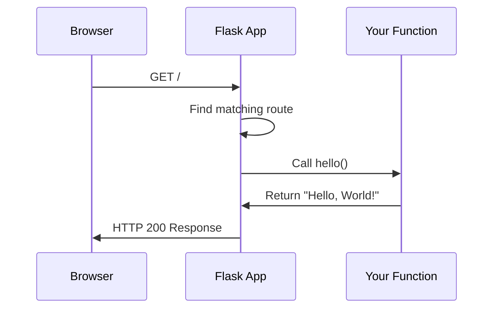

# Chapter 1: Flask Application

Welcome to the Flask tutorial! Let's start with the heart of every Flask project: the **Flask Application** object.

## What Problem Does This Solve?

Imagine you want to build a website. You need something to:

- Listen for visitors arriving at your site
- Figure out what page they want
- Run the right code to handle their request
- Send back a response

The **Flask Application** object does all of this! It's like a restaurant manager who coordinates between the kitchen (your code) and customers (web requests).

## Quick Example

```python
from flask import Flask

# Create the application
app = Flask(__name__)

# Define what happens at the home page
@app.route('/')
def hello():
    return 'Hello, World!'
```

This creates a complete web application in just 6 lines! When someone visits your site's home page (`/`), they see "Hello, World!"

## How It Works

When you create `Flask(__name__)`, you're creating the central coordinator for your web app. The `__name__` tells Flask where to find your project's files.



## Key Concepts

### 1. Creating the App

```python
app = Flask(__name__)
```

Think of this as opening your restaurant for business. The `__name__` is like your restaurant's address - it helps Flask find related files.

### 2. Defining Routes

```python
@app.route('/about')
def about_page():
    return 'About us'
```

Routes are like menu items. Each URL path (`/about`) is connected to a function that handles it.

### 3. Running the App

```python
if __name__ == '__main__':
    app.run(debug=True)
```

This starts the development server. The `debug=True` flag auto-reloads when you change code.

## Under the Hood

The Flask app maintains several important pieces:

```python
# Simplified view of what Flask tracks
class Flask:
    def __init__(self, name):
        self.name = name
        self.url_map = {}      # Routes
        self.config = {}       # Settings
        self.blueprints = {}   # Modules
```

When a request arrives:

1. Flask looks up the URL in `url_map`
2. Finds the matching function
3. Creates a [Request Context](03_request_context.md)
4. Calls your function
5. Converts the return value to an HTTP response

## Summary

The Flask Application is your web app's foundation. It:

- Coordinates all incoming requests
- Maps URLs to handler functions
- Manages configuration and extensions

Next, we'll learn how [Routing](02_routing.md) connects URLs to your code in more detail.

---

Generated by [Codebase Tutorial Skill](https://github.com/anthropics/claude-cookbooks/tree/main/skills)
