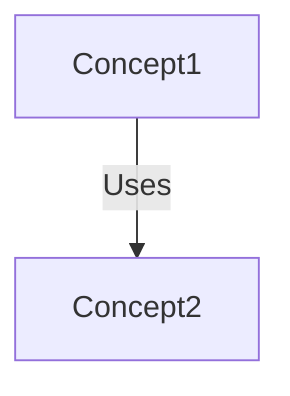

# Output Format

## index.md Structure

````markdown
# Tutorial: {project_name}

{summary}

**Source Repository:** [{repo_url}]({repo_url})


````

## Chapters

1. [Concept1](01_concept1.md)
2. [Concept2](02_concept2.md)

````

## Chapter Structure

```markdown
# Chapter N: Concept Name

[Transition from previous chapter]

## Motivation
What problem does this solve? Concrete use case.

## Key Concepts
Break down into digestible pieces with analogies.

## How to Use
Example inputs/outputs, code snippets (<10 lines each).

## Under the Hood
Sequence diagram + code walkthrough.

## Summary
What we learned + link to next chapter.
````
