---
description: Wrapper-level hub include for skill SKILL.md files — bundles self-update requirement and CLI tool discovery. Used by the wrapper pattern (SKILL.md is a thin wrapper that runs refresh.sh then reads INSTRUCTIONS.md).
---

---
description: Self-update requirement template for AI guidance files to track usage for maintenance and cleanup
---

### Self-Update Requirement

**CRITICAL**: When this guidance file is called, you MUST update the `last-used`
field in this file's front-matter to the current date (YYYY-MM-DD format).

**Ordering — wrapper-pattern skills**: If this skill uses the wrapper pattern
(has a `## Refresh` section that runs `scripts/refresh.sh`), you MUST run
`refresh.sh` FIRST, then update `last-used`. `refresh.sh` runs
`pnpm dlx skills update <skill-name>`, which overwrites the entire skill
directory — including `SKILL.md` and its frontmatter. If you update `last-used`
before running `refresh.sh`, the update overwrites your change and `last-used`
reverts to the published value. `refresh.sh` also sets `last-used` to today
deterministically after the update completes, so the field stays current even
when the AI forgets. The manual update here is a fallback for when
`refresh.sh` is skipped (`SKIP_SKILL_REFRESH=1`, inside `skills-src`, or
daily-cache hit).

**Ordering — non-wrapper artifacts** (workflows, rules, knowledge bundles, and
skills without `refresh.sh`): update `last-used` before proceeding with any
other work. There is no refresh step to overwrite the field.

After updating `last-used`, the `freshness-check` include (which follows this
one in `base-ai-guidance`) checks whether the artifact's 3rd-party technology
references are stale (>90 days since `date.knowledge-basis`). If stale, it
prompts a subagent validation pass and user-approved source update. See
`freshness-check.md` for the full protocol.


---
description: Shared CLI tool discovery — run cli-tool-discovery.sh to find and run tools through environment wrappers and standard PATH locations before giving up. Also resolves the canonical ad-hoc runner for an ecosystem (python/node/rust/go) via --runner.
---

### CLI Tool Discovery

Before concluding a CLI tool is unavailable, run `cli-tool-discovery.sh`. It
detects environment wrappers (devbox, mise, flox, direnv, nix), searches 30+
standard PATH locations, checks package managers (brew, mise, asdf), and
finally checks repo-root fallback dirs (`$REPO_ROOT/bin`, `scripts/`,
`.local/bin`) as a last resort — all in one pass. **Never give up on
the first `command -v` failure.**

For ad-hoc package execution (e.g. `uvx`, `pnpm dlx`, `cargo binstall`, `go
install`), use `--runner <ecosystem>` instead of resolving the binary and
hardcoding the invocation. The runner mode is the single source of truth for
"how do I invoke an ad-hoc command in ecosystem X?" — it pairs the binary
resolution with the canonical invocation pattern from the tech-stack table.

#### Get the script

```bash
# Skills: the script is materialized into scripts/cli-tool-discovery.sh at build time
bash scripts/cli-tool-discovery.sh <tool-name>

# Workflows, agents, and rules (no scripts/ directory): fetch from the public releases repo
curl -fsSL https://raw.githubusercontent.com/levonk/skills-releases/main/includes/cli-tool-discovery.sh -o /tmp/cli-tool-discovery.sh
bash /tmp/cli-tool-discovery.sh <tool-name>
```

#### Usage

```bash
# Resolve only — print where the tool is or how to run it
cli-tool-discovery.sh <tool-name>          # text output
cli-tool-discovery.sh <tool-name> --json   # JSON output (for scripts)

# Resolve and exec — runs the tool through the right wrapper/path, never returns
cli-tool-discovery.sh -- <tool-name> [args...]

# Resolve the ad-hoc runner for an ecosystem (JSON only)
cli-tool-discovery.sh --runner <python|node|rust|go>
```

#### Output (resolve mode)

| Output | Meaning | Action |
|--------|---------|--------|
| `FOUND: <path>` | Tool found at a specific path | Use that path directly |
| `WRAPPER: <wrapper-cmd>` | Tool is inside an environment wrapper | Run via the wrapper (e.g. `devbox run -- <tool>`) |
| `NOT_FOUND: <tool>` | Tool not found anywhere | Install it (ask user first) |

In exec mode (`--`), the script resolves the tool and replaces itself with
the tool process — stdout/stderr/exit code pass through directly. If the tool
is inside a wrapper, it execs through the wrapper. If not found, exits 127.

#### Devbox-aware resolution flow

The devbox shell environment variable (`DEVBOX_SHELL` or `IN_DEVBOX_SHELL`)
is checked **first**, before any other resolution. This simplifies all
downstream logic: if we're already inside a `devbox shell`, devbox-managed
binaries are on `PATH` and no wrapper detection is needed (mise/flox/direnv/nix
are skipped entirely).

- **Inside a `devbox shell`** (env var set): `command -v` → path-exhaustion →
  `devbox add <tool>` → retry. If found, returns `FOUND`; otherwise skips
  other wrappers and goes directly to the nix/uv fallback.
- **Not inside a `devbox shell`**, but devbox is available and a `devbox.json`
  exists up the tree: verifies the tool exists inside the devbox environment
  (`devbox run -- command -v <tool>`). If not found, tries `devbox add` +
  recheck. If confirmed available, returns `WRAPPER:devbox run --`. If still
  not found inside devbox, falls through to normal flow and nix/uv fallback.
- **devbox unavailable or no `devbox.json`**: normal flow — `command -v`,
  other wrappers (mise, flox, direnv, nix), path-exhaustion.

#### nix/uv fallback

When the tool is not found by any of the above methods, the script tries to
install it via available package managers — searching the repo first before
attempting install:

- **uv → pip** (special case for `tool == uv`): ensures uv is recorded in
  devbox.json and falls back to pip/pip3/python3 -m pip for Python package
  operations.
- **nix**: if nix is available, searches nixpkgs for `<tool>` (via
  `nix eval nixpkgs#<tool>.meta.mainProgram`). If a package exists, installs
  it via `nix profile install` and rechecks PATH.
- **uv**: if uv is available, tries `uv tool install <tool>` from PyPI
  (the install attempt itself serves as the search — it fails fast if the
  package doesn't exist). If successful, rechecks PATH.

#### Repo-root fallback (last resort)

After all system PATH locations and package manager lookups are exhausted,
the script checks `$REPO_ROOT/bin`, `$REPO_ROOT/scripts`, and
`$REPO_ROOT/.local/bin` as a **last resort**. This covers project-local tool
shim layouts like [Hermit](https://cashapp.github.io/hermit/), where
`bin/<tool>` symlinks auto-bootstrap the tool on first run.

**Why last?** Repo-root `bin/` directories are the least secure search
location — a cloned repository could contain malicious executables in `bin/`.
System paths, home directories, and package managers are all more trustworthy
because they require explicit installation or system-level access. By
searching repo-root `bin/` only after everything else fails, the script
minimizes the risk of a rogue project binary shadowing a legitimate system
tool.

Tech-stack-specific repo dirs (`node_modules/.bin`, `target/release`,
`.venv/bin`, `vendor/bin`, etc.) are **not** deferred — they are
build-system-managed and stay in the normal search order. Only the
unconditional `$REPO_ROOT/bin` / `scripts/` / `.local/bin` fallback is
deferred to last.

```mermaid
flowchart TD
    Start["cli-tool-discovery.sh<br/>resolve_tool()"] --> InShell{"1. In devbox shell?<br/>(DEVBOX_SHELL /<br/>IN_DEVBOX_SHELL)"}
    InShell -- "yes" --> ShellPathCheck{"1a. On PATH?<br/>(command -v)"}
    ShellPathCheck -- "yes" --> FoundShellPath["FOUND: path"]
    ShellPathCheck -- "no" --> ShellExhaust["1b. Path-exhaustion<br/>(standard locations +<br/>package managers)"]
    ShellExhaust --> ShellExhaustFound{"found?"}
    ShellExhaustFound -- "yes" --> FoundShellExhaust["FOUND: path"]
    ShellExhaustFound -- "no" --> DevboxAdd["1c. devbox add tool<br/>(install into project)"]
    DevboxAdd --> RetryCheck{"1d. Retry: on PATH or<br/>path-exhaustion found?"}
    RetryCheck -- "yes" --> FoundRetry["FOUND: path"]
    RetryCheck -- "no" --> FallbackStart["4. nix/uv fallback"]
    InShell -- "no" --> DevboxAvail{"2. devbox available?<br/>(command -v devbox)"}
    DevboxAvail -- "no" --> NormalFlow["3. Normal flow"]
    DevboxAvail -- "yes" --> DevboxJson{"devbox.json exists<br/>up the tree?"}
    DevboxJson -- "no" --> NormalFlow
    DevboxJson -- "yes" --> DevboxVerify["2a. On PATH inside devbox?<br/>(devbox run -- command -v)"]
    DevboxVerify --> DevboxVerifyFound{"found?"}
    DevboxVerifyFound -- "yes" --> WrapperDevbox["WRAPPER: devbox run --"]
    DevboxVerifyFound -- "no" --> DevboxAdd2["2b. devbox add + recheck<br/>inside devbox"]
    DevboxAdd2 --> DevboxAddFound{"found?"}
    DevboxAddFound -- "yes" --> WrapperDevbox
    DevboxAddFound -- "no" --> NormalFlow
    WrapperDevbox -- "caller execs<br/>devbox run -- tool" --> ShellPathCheck
    NormalFlow --> NormalPathCheck{"3a. On PATH?<br/>(command -v)"}
    NormalPathCheck -- "yes" --> FoundNormalPath["FOUND: path"]
    NormalPathCheck -- "no" --> OtherWrappers["3b. Other wrappers<br/>(mise, flox, direnv, nix)"]
    OtherWrappers --> NormalExhaust["3c. Global path-exhaustion<br/>(standard locations +<br/>package managers)"]
    NormalExhaust --> NormalExhaustFound{"found?"}
    NormalExhaustFound -- "yes" --> FoundNormalExhaust["FOUND: path"]
    NormalExhaustFound -- "no" --> RepoRootFallback["3d. Repo-root fallback<br/>($REPO_ROOT/bin, scripts/,<br/>.local/bin — LAST, least secure)"]
    RepoRootFallback --> RepoRootFound{"found?"}
    RepoRootFound -- "yes" --> FoundRepoRoot["FOUND: path"]
    RepoRootFound -- "no" --> FallbackStart
    FallbackStart --> UvSpecial{"4a. tool == uv?"}
    UvSpecial -- "yes" --> PipFallback["FALLBACK: pip<br/>(ensure_devbox_package + pip)"]
    UvSpecial -- "no" --> NixFallback{"4b. nix available?<br/>search nixpkgs for tool"}
    NixFallback -- "found + installed" --> NixRecheck["recheck PATH"]
    NixRecheck --> NixFound{"found?"}
    NixFound -- "yes" --> FoundNix["FOUND: path"]
    NixFound -- "no" --> UvFallback{"4c. uv available?<br/>uv tool install tool"}
    NixFallback -- "not found" --> UvFallback
    UvFallback -- "installed" --> UvRecheck["recheck PATH"]
    UvRecheck --> UvFound{"found?"}
    UvFound -- "yes" --> FoundUv["FOUND: path"]
    UvFound -- "no" --> NotFound["5. NOT_FOUND"]
    UvFallback -- "not found" --> NotFound
```



#### Output (runner mode)

`--runner <ecosystem>` emits JSON only:

```json
{
  "ecosystem": "python",
  "binary": "uv",
  "binary_status": "found",
  "binary_path": "/usr/local/bin/uv",
  "wrapper": "",
  "script": "uv run --script",
  "package": "uvx",
  "fallback": "pip install + python3",
  "fallback_runner": "python3",
  "recommendation": ""
}
```

| Field | Meaning |
|-------|---------|
| `binary` | The canonical binary for the ecosystem (`uv`, `pnpm`/`bun`, `cargo`, `go`) |
| `binary_status` | `found` (use `binary_path`), `wrapper` (use `wrapper`), `not_found` (use `fallback`/`recommendation`) |
| `script` | The runner for inline-metadata scripts (PEP 723). Empty for ecosystems without an equivalent. |
| `package` | The runner for ad-hoc package execution (`uvx`, `pnpm dlx`, `bunx`, `cargo binstall -y`, `go install`) |
| `fallback` | The fallback approach when the binary is not found (e.g. `pip install + python3`). Empty if no fallback exists. |
| `fallback_runner` | The command to use for the fallback. Empty if no fallback exists. |
| `recommendation` | When `binary_status` is `not_found`: either "add to devbox.json", "use fallback", or "install manually". Empty otherwise. |

Ecosystem mapping:

| Ecosystem | Binary | Script runner | Package runner | Fallback |
|-----------|--------|---------------|----------------|----------|
| `python` | `uv` | `uv run --script` | `uvx` | `pip install + python3` |
| `node` (host) | `pnpm` | — | `pnpm dlx` | none (install pnpm) |
| `node` (container) | `bun` | — | `bunx` | none |
| `rust` | `cargo` | — | `cargo binstall -y` | `cargo install` |
| `go` | `go` | — | `go install` | none |

Container detection for `node`: checks `/.dockerenv`, `$DOCKER_CONTAINER`, or
container markers in `/proc/1/cgroup`. This matches the tech-stack table's
"inside a container → bunx" rule.

The Python include (`cli-tool-discovery.py.tmpl`) provides `resolve_runner(ecosystem)`
returning the same dict shape, for use inside Python scripts that need to
discover the runner programmatically.

#### When to Use

- **Always**, before reporting a tool as "not found" or "not installed"
- When a build/test/lint command fails with "command not found"
- When a skill or workflow script needs a tool that isn't on PATH
- When the user reports a tool "should be installed" but `command -v` fails
- **For ad-hoc package execution**, use `--runner <ecosystem>` instead of
  hardcoding `uvx` / `pnpm dlx` / `cargo binstall` / `go install` — the
  runner mode keeps the binary resolution and the invocation pattern paired
  and consistent with the tech-stack table

#### Anti-Patterns

- **Giving up on first `command -v` failure** — run the script instead
- **Installing a tool without asking** — always confirm before adding packages
- **Ignoring environment wrappers** — if a `devbox.json` exists, the tool is
  likely inside devbox, not on the bare shell
- **Hardcoding `uvx` / `pnpm dlx` / `cargo binstall` / `go install`** — use
  `--runner <ecosystem>` instead so the binary and invocation stay paired
  and the policy lives in one place (the tech-stack table, mirrored by the
  runner mode)

#### Timeout configuration

All internal probe and install operations are hang-safe — they run with a
timeout so a broken devbox, slow brew cache, or stalled nix substituter
cannot block the resolver indefinitely. Exec mode (`-- <tool> [args]`) is
never timed; it's the user's command.

| Env var | Default | Scope |
|---------|---------|-------|
| `CLTOOL_PROBE_TIMEOUT_SECS` | `30` | Lookups: `brew list`, `brew --prefix`, `mise which`, `asdf which`, `nix eval`, `rtk rewrite` |
| `CLTOOL_INSTALL_TIMEOUT_SECS` | `120` | Network installs: `devbox add`, `nix profile install`, `uv tool install` |
| `DEVBOX_PROBE_TIMEOUT_SECS` | `15` | `devbox run -- command -v` probes specifically |

On timeout, the probe or install is treated as a failure and the resolver
falls through to the next strategy (ultimately `NOT_FOUND`). Override the
defaults for slow networks or cold caches:

```bash
CLTOOL_PROBE_TIMEOUT_SECS=60 CLTOOL_INSTALL_TIMEOUT_SECS=300 bash cli-tool-discovery.sh <tool>
```

The Python include (`cli-tool-discovery.py.tmpl`) reads the same env vars
(`CLTOOL_PROBE_TIMEOUT_SECS`, `CLTOOL_INSTALL_TIMEOUT_SECS`) and applies
them to `subprocess.run(..., timeout=...)` calls in `resolve_tool` and
`_rtk_supports`. `subprocess.TimeoutExpired` is caught and treated as
not-found. `run_tool` / `run_tool_exec` / `devbox_run` / `rtk_wrap` pass
`**kwargs` through to `subprocess.run`, so callers can opt into a timeout
by passing `timeout=<secs>` if needed.


# Git Repository Management

## Refresh

Before doing anything else, ensure this skill is current:

1. Run `scripts/refresh.sh`. Its stdout is this skill's current body
   (`INSTRUCTIONS.md`). The script handles: finding pnpm via
   cli-tool-discovery, checking the daily-refresh cache, running
   `pnpm dlx skills update <skill-name>` (sandboxed via nono if available),
   and printing `INSTRUCTIONS.md`.

2. Read the script output. That file contains the actual outcome,
   guardrails, calibration, and current process. Do not proceed until
   you have read it.

If the update fails (no network, pnpm unavailable), the script prints
the on-disk version of `INSTRUCTIONS.md` — stale content is better
than no content.

## Worktree Isolation Hook

This skill provides `scripts/hooks/pre-commit-worktree-isolation.sh` — a
pre-commit hook that blocks commits to `main`/`master` (or other protected
branches) when not working inside a linked git worktree. This enforces the
worktree-per-feature workflow that `execute-upsert` and this skill expect.

The `project-adopter` skill installs this hook (alongside the
submodule-integrity hook) as part of project adoption. For repos not
adopted via `project-adopter`, copy the script to `scripts/hooks/` and
set `git config core.hooksPath scripts/hooks`.

# Worktree Enforcement Bypass Table

The worktree-per-feature workflow is enforced by two machine gates. Both
have bypass mechanisms designed to be **asymmetric** — the user can
bypass but the agent can't:

| Gate | Bypass | How user bypasses | Why agent can't |
|------|--------|-------------------|-----------------|
| Pre-commit hook | `SKILL_ALLOW_MAIN_WRITE=1` | Set in your shell: `SKILL_ALLOW_MAIN_WRITE=1 git commit ...` | Visible in the exec tool call output — you see it |
| PreToolUse hook | `SKILL_BYPASS_GATE=1` | Set at session launch: `SKILL_BYPASS_GATE=1 devin` | Hook inherits session env, not command env — agent can't set session-level vars mid-session |
| Both | `git commit --no-verify` | Type it in your shell | Agent would have to pass `--no-verify` in its exec command — visible |
| Config file | `.agents/config/script-guards.toml` | Create with `[worktree-isolation] allow_main_write = true` | Agent can write files, but the change is visible in git diff and the file is version-controlled |

## Read-Only Profile Exemption (not a bypass — a correct non-application)

The PreToolUse hook inspects the `profile` field in the `run_subagent`
`tool_input`. `subagent_explore` dispatches are **allowed without a
gate-pass** — this is not a bypass, it is a correct non-application of the
gate. The gate exists to prevent mutation of the main working directory;
`subagent_explore` has profile-enforced read-only tool access (grep, glob,
read, web_search — no edit/write/exec) and cannot mutate anything. The
exemption is enforced at the tool layer, so an agent cannot escalate a
read-only dispatch to write capability by prompt content alone.

| Profile | Gate required? | Why |
|---------|----------------|-----|
| `subagent_explore` | No | Read-only tool access — cannot mutate the working directory |
| `subagent_general` | Yes | Full tool access (foreground) — can edit/write/exec |
| Custom write-capable | Yes | Has edit/write/exec access |
| Custom read-only | No | If the profile restricts tools to read-only set |
| Missing/empty profile | Yes | Fail-closed — treat as write-capable |

**Do not abandon subagent dispatch to avoid the gate.** If a write-capable
dispatch is blocked, run `execution-gate.sh` and re-dispatch. Dropping the
subagent to do the work inline is circumvention, not compliance (binding
contract rule 9).

The config file bypass is also available for repos that don't use the
worktree-per-feature workflow (e.g., single-maintainer repos where
worktrees add overhead without benefit):

```toml
# .agents/config/script-guards.toml
[worktree-isolation]
allow_main_write = true
protected_branches = ["main", "master"]  # optional override
```


---

## Content Ordering

This artifact is optimized for machine consumption. Generic framework content
(shared includes, knowledge bundles) appears before the skill-specific body.
This ordering maximizes cross-skill prefix caching: skills that share the same
includes produce identical byte prefixes, so an LLM context cache warmed by one
skill serves all skills that share the same preamble.

This is sub-optimal for human reading — the skill-specific content starts deep
in the file, after the generic preamble. Human readers can jump to the
skill-specific body by searching for the first `# ` heading that follows the
generic sections. Each section is self-contained and documented with its own
heading hierarchy.

