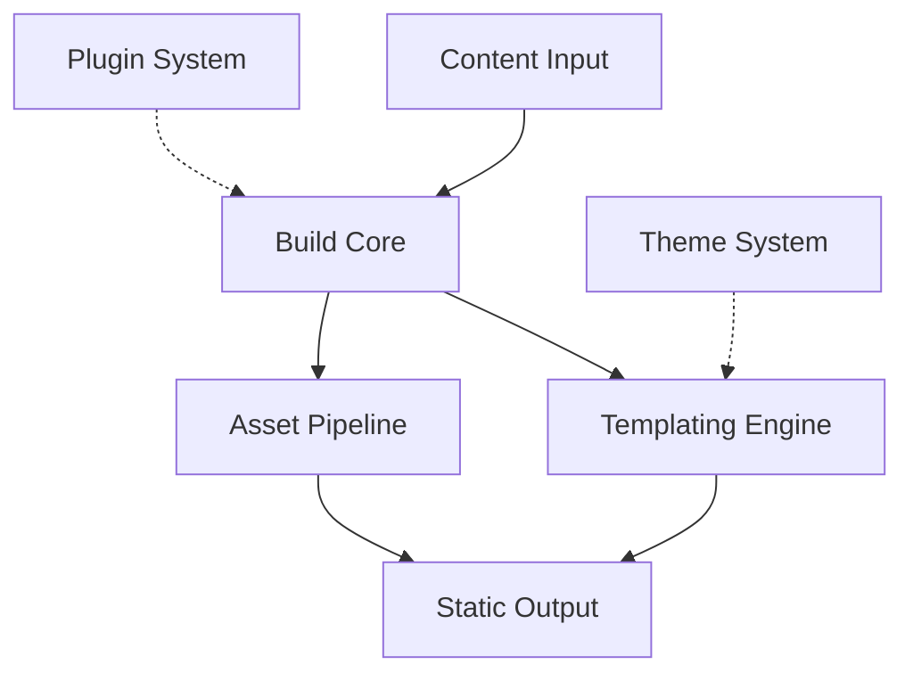
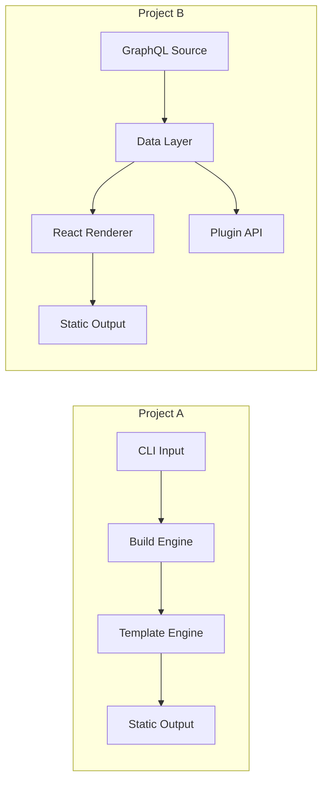
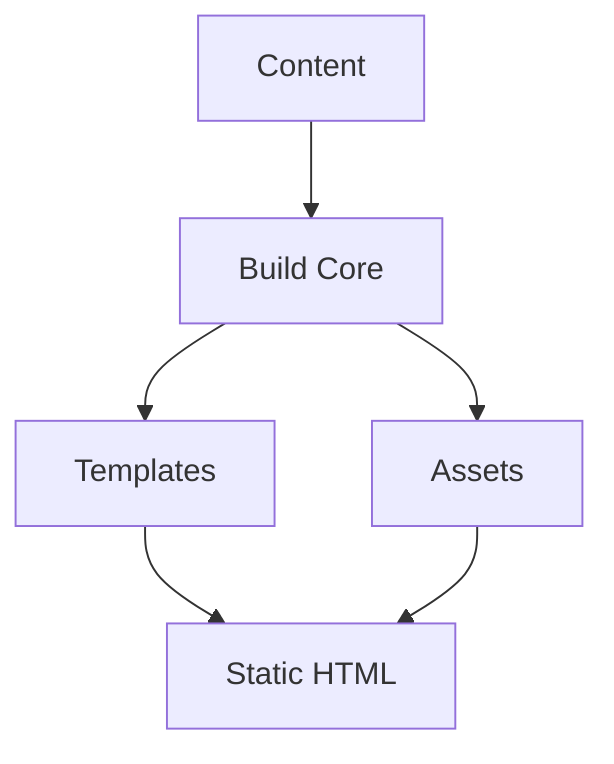

# Architectural Comparison

## Table of Contents

1. [Overview](#overview)
2. [When to Diagram vs. When to Skip](#when-to-diagram-vs-when-to-skip)
3. [Identifying Architectural Patterns](#identifying-architectural-patterns)
4. [Mermaid Diagram Patterns](#mermaid-diagram-patterns)
5. [Side-by-Side Comparison](#side-by-side-comparison)
6. [Summarizing Implications](#summarizing-implications)

## Overview

The architectural comparison step examines *how* the projects work — their
component structure, data flow, and design patterns — rather than *what*
features they have (covered by the feature matrix). The goal is to surface
architectural differences that affect extensibility, performance, deployment,
or operational complexity.

Key principle: **don't manufacture differences where none exist.** If the
projects are architecturally similar, say so in one sentence and move on.

## When to Diagram vs. When to Skip

| Situation | Action |
|---|---|
| Projects use fundamentally different architectures | Diagram each project separately + comparison summary |
| Projects use the same pattern with minor variations | One shared diagram + note the variations |
| Projects are architecturally near-identical | No diagram — state "Architecturally there is little difference of note" + one brief sentence on the shared pattern |
| Only one project (others excluded after classification) | Skip — architectural comparison needs 2+ projects |

### What counts as "fundamentally different"

- Different process models (e.g., in-process library vs. server-client vs. CLI pipeline)
- Different extension models (e.g., plugin architecture vs. monolithic vs. configuration-driven)
- Different data flow (e.g., pull-based vs. push-based, synchronous vs. event-driven)
- Different deployment topologies (e.g., single binary vs. container orchestration vs. serverless)

### What does NOT count as "fundamentally different"

- Different languages (that's in the tech stack meta-feature)
- Different build tools (that's in project-detection)
- Different CI/CD platforms (that's in the feature matrix)
- Cosmetic naming differences for the same pattern

## Identifying Architectural Patterns

For each project, identify:

1. **Process model**: How does the system run? (library, CLI, server, daemon,
   serverless function, browser app, pipeline)
2. **Component structure**: What are the major components and how do they
   relate? (core + plugins, monolith, microservices, layered, hexagonal)
3. **Data flow**: How does data move through the system? (request-response,
   event-driven, pipeline/staged, batch, stream)
4. **Extension model**: How do users extend the system? (plugins, hooks,
   middleware, configuration, scripting, APIs)
5. **State management**: Where does state live? (in-memory, file-based,
   database, distributed, stateless)
6. **Deployment topology**: How is it deployed? (single binary, container,
   orchestration platform, hosted service, embedded)

Sources for this analysis:
- README and architecture docs
- Source code directory structure (top-level packages/modules)
- Configuration files (reveal what's configurable = what's componentized)
- `project-detection` output (build systems, CI/CD hint at topology)

## Mermaid Diagram Patterns

Use mermaid flowcharts (`graph TD` or `graph LR`) for architectural diagrams.
Keep them high-level — 5-10 nodes max. The goal is communication, not
exhaustive documentation.

### Pattern 1: Single-project architecture diagram

### Pattern 2: Side-by-side comparison

When projects differ, place them side by side in one diagram using subgraphs:

### Pattern 3: Shared architecture with variations noted

When projects share a pattern, diagram it once and annotate variations:

Then in prose: "All three projects follow the same content → build core →
template/asset pipeline → static output flow. Project A adds a plugin system
off the build core; Project B adds a GraphQL data layer before the build core;
Project C is the simplest with no extension points."

## Side-by-Side Comparison

After diagramming (or deciding to skip), produce a brief comparison table if
there are architectural differences:

| Aspect | Project A | Project B | Project C |
|---|---|---|---|
| Process model | CLI pipeline | Server + build | CLI pipeline |
| Extension model | Plugins | React components | None |
| Data flow | Pull-based | GraphQL-driven | Pull-based |
| State | File-based | In-memory + cache | File-based |
| Deployment | Single binary | Node server + CDN | Single binary |

If the table would be all-identical, skip it — that's the "little difference
of note" case.

## Summarizing Implications

Note how architectural differences affect real-world concerns — but only where
there are actual differences:

- **Extensibility**: Does the extension model allow adding features without
  forking? (plugin system vs. monolithic)
- **Performance characteristics**: Does the data flow affect build time,
  latency, or throughput? (incremental vs. full rebuild, in-memory vs. I/O-bound)
- **Deployment complexity**: How many moving parts need to be deployed and
  monitored? (single binary vs. server + database + CDN)
- **Operational complexity**: Does the architecture require ongoing
  maintenance, background processes, or state management?

**Do not repeat the feature matrix.** If the feature matrix already covers
"plugin system: ✅/❌", the architectural comparison should focus on *how* the
plugin system works (hook-based vs. lifecycle-based vs. component-based), not
*whether* it exists. If there's no architectural difference in a dimension,
skip it.
