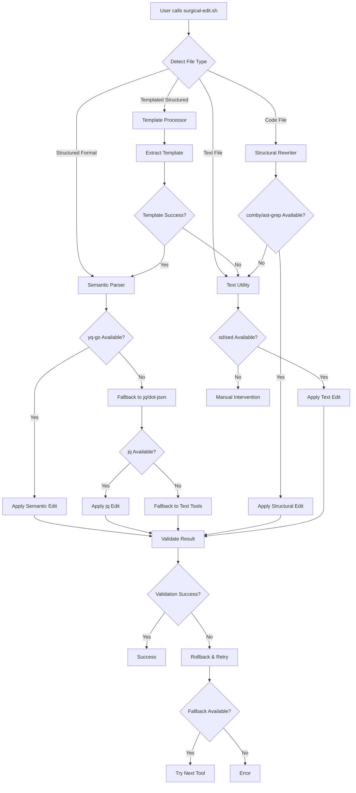

# Tool Selection

## Tool Selection Logic

## File Type Detection

| File Type | Extensions | Primary Tool | Fallback Tools | Special Handling |
|-----------|-------------|--------------|----------------|------------------|
| **Templated Structured** | `*.json.jinja`, `*.yaml.jinja`, `*.yml.jinja`, `*.toml.jinja`, `*.xml.jinja`, `*.cfg.jinja`, `*.conf.jinja`, `*.ini.jinja` | Template Processor → Semantic Parser | Text Utilities | Extract template, process structured data |
| **Structured** | `*.json`, `*.yaml`, `*.yml`, `*.toml`, `*.xml` | yq-go (preserves comments) | jq, jo, dot-json, comby, sd | yq-go preferred for comment preservation |
| **Code** | `*.rs`, `*.js`, `*.ts`, `*.py`, `*.go`, `*.java`, `*.c`, `*.cpp`, `*.hs`, `*.php`, `*.rb`, `*.swift`, `*.kt` | comby, ast-grep | sd | Pattern-based transformations |
| **Configuration** | `*.env`, `*.conf`, `*.ini`, `*.cfg`, `*.properties`, `*.tfvars`, `*.hcl` | sd | sed | Simple text operations |
| **Markup** | `*.md`, `*.rst`, `*.tex`, `*.adoc` | sd | sed, pandoc | Structured text operations |
| **Text** | `*.txt`, `*.log`, `*.csv` | sd | sed, echo | Line-based operations |
| **Binary Configs** | `*.plist`, `*.binary` | hexedit, xxd | Manual intervention | Binary file operations |
